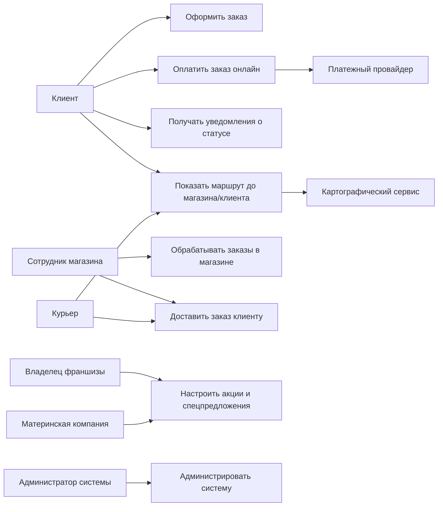


# Лабораторная работа №1  
**Дисциплина:** Проектирование архитектуры программных систем  

## Тема

Формулирование требований к программной системе  
Кейс: онлайн-система заказов и оповещения клиентов для национальной сети сэндвич-магазинов.

## Цель работы

Научиться на простом примере:
- выделять основных заинтересованных лиц,
- формулировать функциональные требования к системе,
- фиксировать предположения,
- выбирать несколько ключевых нефункциональных требований,
- показать все это на одной понятной диаграмме вариантов использования.

---

## Перечень заинтересованных лиц (стейкхолдеров)

1. **Клиент**  
   Человек, который заказывает сэндвич через сайт или мобильное приложение. Для него важно быстро оформить заказ, понять, когда заказ будет готов, и при необходимости получить доставку.

2. **Сотрудник магазина**  
   Работает в конкретной точке (кассир, оператор, менеджер смены). Видит новые заказы, готовит их, отмечает статусы, передает заказ клиенту или курьеру.

3. **Курьер**  
   Доставляет заказ клиенту. Получает адрес, маршрут и статусы заказа, отмечает факт доставки.

4. **Владелец франшизы**  
   Владеет одним или несколькими магазинами. Интересуется количеством заказов, акциями, выручкой, удобством работы сотрудников с системой.

5. **Материнская компания**  
   Управляет брендом на уровне всей сети. Запускает общенациональные акции, думает о выходе на зарубежные рынки, следит за едиными стандартами сервиса.

6. **Администратор системы**  
   Технический специалист, который занимается поддержкой системы: права доступа, настройки интеграций с картами и платежами, общие параметры работы.

---

## Перечень функциональных требований

Требования формулируем максимально по-человечески и привязываем к тому, кто этим пользуется.

**FR1. Регистрация и вход клиента**  
Клиент должен иметь возможность зарегистрироваться и войти в систему (по телефону, email или через соцсеть), чтобы сохранялась история заказов и настройки.

**FR2. Выбор магазина и способа получения заказа**  
Клиент должен иметь возможность:
- найти ближайший магазин по геолокации или выбрать его из списка,
- указать, хочет он самовывоз или доставку.

**FR3. Оформление заказа**  
Клиент должен иметь возможность:
- выбрать сэндвичи и другие позиции из меню,
- настроить состав (добавки/убрать ингредиенты),
- указать количество,
- увидеть итоговую стоимость до оплаты.

**FR4. Применение акций и спецпредложений**  
Система должна:
- автоматически применять национальные акции, заданные материнской компанией,
- автоматически применять локальные акции, настроенные владельцем франшизы,
- показывать клиенту, какие скидки и предложения сработали в его заказе.

**FR5. Оплата заказа**  
Клиент должен иметь возможность:
- оплатить заказ онлайн через интегрированного платежного провайдера,
- выбрать оплату при получении в магазине,
- выбрать оплату при доставке (наличными или картой, если это поддерживается франшизой).

**FR6. Оповещение клиента о статусе заказа**  
Система должна оповещать клиента о ключевых статусах:
- заказ принят,
- заказ готовится,
- заказ готов к самовывозу,
- заказ передан курьеру,
- заказ доставлен/получен.  
Уведомления отправляются через мобильное приложение (push) и/или email.

**FR7. Показ маршрута и времени в пути**  
Система должна уметь через картографический сервис:
- для самовывоза - показать клиенту путь до магазина и оценочное время в пути,
- для доставки - дать курьеру маршрут до клиента и оценочное время прибытия.

**FR8. Управление заказами в магазине**  
Сотрудник магазина должен иметь интерфейс, где он:
- видит новые заказы,
- подтверждает и начинает их готовить,
- меняет статусы заказов до момента передачи клиенту или курьеру.

**FR9. Работа курьера с заказами**  
Курьер должен иметь простой интерфейс:
- видеть список назначенных заказов,
- получать маршрут до клиента,
- отмечать заказ как доставленный.

**FR10. Настройка акций и базовое управление системой**  
- Владелец франшизы должен иметь возможность настраивать локальные акции и видеть базовую отчетность по заказам своего магазина.  
- Материнская компания должна иметь возможность задавать национальные акции.  
- Администратор системы - добавлять магазины, пользователей и подключать интеграции (карты, платежи).

---

## Диаграмма вариантов использования

Ключевые сценарии взаимодействия акторов с системой показаны на диаграмме вариантов использования ниже.

## Перечень сделанных предположений

Ниже перечислены предположения, которые не указаны явно в постановке задачи, но влияют на формулировку нефункциональных требований и архитектурные решения.

1. **Основной канал использования - мобильные устройства**  
   Предполагается, что большинство клиентов оформляет заказы со смартфонов.  
   Это усиливает требования к удобству использования и быстродействию клиентской части.

2. **Базовые каналы уведомлений - push и email**  
   В первой версии системы считаем достаточными push-уведомления и email. SMS и другие каналы могут добавляться по мере необходимости.  
   Это влияет на требования к надежности отправки уведомлений и к масштабируемости подсистемы уведомлений.

3. **Онлайн-оплата через внешнего платежного провайдера**  
   Система не хранит данные банковских карт клиентов. Все онлайн-платежи проходят через интегрированного сертифицированного платежного провайдера.  
   Это снижает нагрузку на систему в части соответствия платежным стандартам, но повышает требования к безопасности интеграции и обработке статусов платежей.

4. **Доставка организуется силами франчайзи**  
   Каждый владелец франшизы сам отвечает за курьеров или партнеров по доставке. Система не управляет расписанием и автопарком, а только фиксирует статусы заказов и показывает маршруты.  
   Это упрощает функционал системы, но оставляет высокие требования к скорости обработки заказов и обновлению статусов.

5. **Международное расширение - будущий этап, заложенный в архитектуру**  
   На первом этапе система запускается в одной стране, но при проектировании предполагается возможность добавления новых стран, языков, валют и налоговых правил без полной переработки.  
   Это напрямую влияет на требования к расширяемости и конфигурируемости системы.

---

## Перечень нефункциональных требований

Из множества возможных нефункциональных требований выбраны несколько наиболее важных для первой очереди реализации.

### NFR1. Удобство использования

- Интерфейс клиента и курьера должен быть понятным без обучения.  
- Оформление простого заказа для постоянного клиента не должно занимать более 3-4 логичных шагов.  
- Основные сценарии (оформление заказа, просмотр статуса, показ маршрута) должны корректно работать как на смартфонах, так и на настольных браузерах.  

*Пояснение:* удобство напрямую влияет на конверсию заказов и частоту повторных покупок.

---

### NFR2. Производительность и масштабируемость

- При типичной нагрузке время ответа на основные операции (открытие меню, оформление заказа, получение статуса) не должно превышать 2 секунд в 95 % запросов.  
- Архитектура системы должна позволять масштабировать отдельные компоненты (например подсистему заказов и уведомлений) при росте числа пользователей с тысяч до сотен тысяч и выше.  

*Пояснение:* сеть магазинов ориентирована на национальный масштаб, в перспективе - на международный, поэтому система должна выдерживать рост нагрузки без полной переработки.

---

### NFR3. Доступность

- Публичная часть системы (оформление заказов и просмотр статусов) должна быть доступна не менее 99.5 % времени.  
- Плановые работы должны выполняться преимущественно в периоды низкой нагрузки и по возможности без полной остановки сервиса.  

*Пояснение:* недоступность системы в рабочее время магазинов приводит к прямым потерям выручки и ухудшению отношения клиентов к бренду.

---

### NFR4. Безопасность и защита данных

- Весь трафик между клиентами, магазинами и сервером должен передаваться только по защищенному протоколу HTTPS.  
- Доступ к административным функциям, настройкам акций и отчетам должен защищаться аутентификацией и ролевой моделью.  
- Персональные данные клиентов и история заказов должны храниться с учетом требований законодательства соответствующей страны, данные банковских карт не сохраняются в системе.  

*Пояснение:* система работает с персональными данными и денежными операциями, что требует базового уровня информационной безопасности уже на первом этапе.

---

### NFR5. Расширяемость

- Добавление нового магазина, города или страны должно выполняться через конфигурацию, а не через изменение кода.  
- Система должна поддерживать мультиязычность интерфейса и возможность подключения нескольких картографических и платежных провайдеров.  
- Логика акций и специальных предложений должна быть реализована так, чтобы можно было добавлять новые типы акций без полной переработки подсистемы.  

*Пояснение:* материнская компания планирует выход на зарубежные рынки, поэтому важно, чтобы система развивалась за счет настройки и постепенного расширения, а не через переписывание ключевых модулей.

