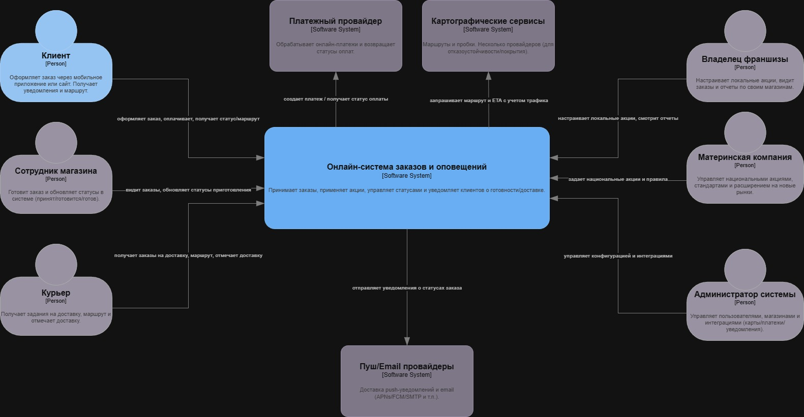
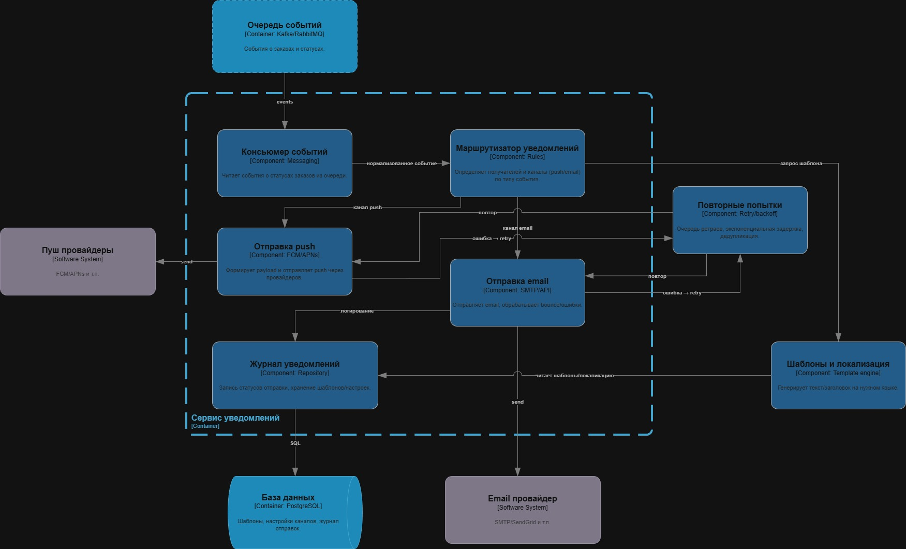

# Лабораторная работа №2

**Тема:** Использование нотации C4 model для проектирования архитектуры программной системы  
**Цель работы:** Получить опыт использования графической нотации для фиксации архитектурных решений.

## Диаграмма системного контекста (C1)

Краткое описание основных элементов:
- **Клиент** — оформляет заказ и получает уведомления/маршрут.
- **Сотрудник магазина** — подтверждает заказ, меняет статусы приготовления.
- **Курьер** — получает задания на доставку, маршрут и отмечает доставку (если доставка доступна).
- **Владелец франшизы** — настраивает локальные акции, смотрит отчеты по своим магазинам.
- **Материнская компания** — управляет национальными акциями и стандартами сети.
- **Администратор системы** — управляет пользователями, магазинами и интеграциями.
- **Онлайн-система заказов и оповещений** — принимает заказы, применяет акции, управляет статусами и отправляет уведомления.
- **Внешние системы:** платежный провайдер, картографические сервисы, push/email провайдеры.

## Диаграмма контейнеров (C2)

Краткое описание основных элементов:
- **Клиентские приложения:** мобильное приложение клиента, веб-сайт/PWA.
- **Интерфейсы персонала:** панель магазина (и/или приложение курьера — если это часть системы).
- **API/Backend** — единая точка входа, аутентификация, маршрутизация запросов к сервисам.
- **Сервис заказов** — создание заказа, статусы, самовывоз/доставка.
- **Сервис акций** — национальные и локальные акции, расчет скидок.
- **Сервис уведомлений** — формирование и отправка уведомлений (push/email), логирование отправок.
- **Сервис интеграций** — адаптеры к картам/платежам (и другим внешним системам).
- **Хранилища/инфраструктура:** база данных, очередь/брокер событий.

### Выбор архитектурного стиля / архитектуры уровня приложений

В качестве базового архитектурного подхода выбрана **модульная сервисная архитектура (на уровне контейнеров)** с сетевым взаимодействием между контейнерами:
- выделены отдельные контейнеры для ключевых подсистем (**заказы**, **уведомления**, **акции**, **интеграции**), что позволяет независимо масштабировать наиболее нагруженные части (например, уведомления при росте пользователей до сотен тысяч/миллионов);
- взаимодействие клиентских приложений с серверной частью происходит по **HTTPS (REST)** через **API/Backend**;
- асинхронные события статусов заказа передаются через **очередь/брокер событий**, что повышает устойчивость уведомлений и снижает связность сервисов;
- интеграции с внешними провайдерами (платежи, карты, push/email) вынесены в отдельные контейнеры/адаптеры, что упрощает замену провайдеров при международном расширении.

## Диаграмма компонентов (C3)

### Компоненты контейнера «Сервис заказов»

Краткое описание:
- **Контроллер заказов / API** — принимает команды и запросы.
- **Сервис управления заказом / бизнес-логика** — оркестрация сценариев создания заказа, смены статусов.
- **Расчет стоимости** — применение скидок (с обращением к сервису акций).
- **Workflow статусов** — правила переходов статуса (принят → готовится → готов → передан курьеру → доставлен).
- **Репозиторий заказов** — работа с БД заказов.
- **Публикация событий** — формирование событий для уведомлений/интеграций через очередь.

### Компоненты контейнера «Сервис уведомлений» (повышенная сложность)

Краткое описание:
- **Консьюмер событий** — читает события о смене статусов заказа из очереди.
- **Маршрутизатор уведомлений** — выбирает канал (push/email) и получателей.
- **Отправка push / отправка email** — интеграция с провайдерами.
- **Журнал уведомлений** — логирование статусов отправки.
- **Повторные попытки** — обработка ошибок, retry/backoff.
- **Шаблоны и локализация** — формирование текста уведомлений.