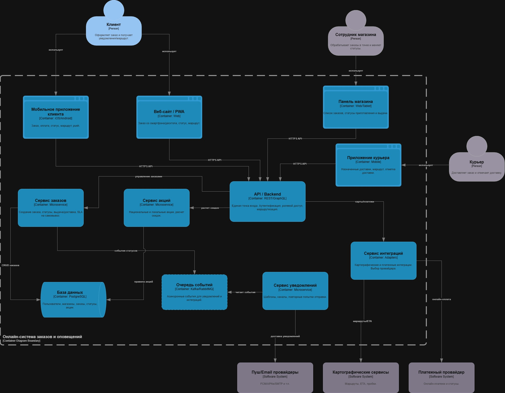
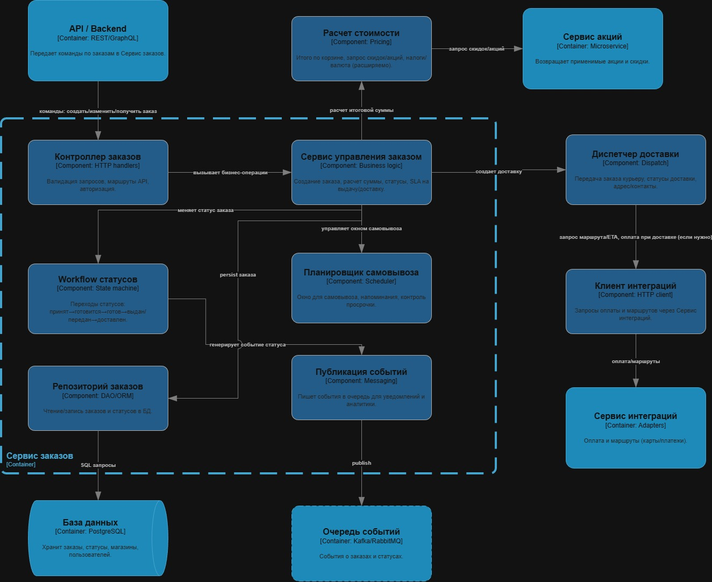

# Лабораторная работа №3

**Тема:** Использование принципов проектирования на уровне методов и классов  
**Цель работы:** Получить опыт проектирования и реализации модулей с использованием принципов KISS, YAGNI, DRY, SOLID и др.

## Выбранный вариант использования

### Название сценария
Изменение статуса заказа и оповещение клиента.

### Цель
Обеспечить корректный переход заказа в следующий статус и уведомить клиента по доступным каналам (push/email).

### Основной актор
Сотрудник магазина (инициирует смену статуса).

### Предусловия
- заказ уже создан в системе;
- сотрудник работает в интерфейсе магазина;
- для заказа известны контактные данные клиента и настройки каналов уведомления;
- API управления заказами доступно.

### Основной сценарий
1. Сотрудник отправляет команду `POST /orders/{order_id}/status` с новым статусом.
2. API передает команду в сервис бизнес-логики.
3. Сервис получает заказ из репозитория.
4. Компонент правил проверяет допустимость перехода статуса.
5. Сервис фиксирует новый статус заказа и сохраняет изменения.
6. Сервис формирует событие об изменении статуса и инициирует отправку уведомлений.
7. API возвращает обновленное состояние заказа и список отправленных уведомлений.

### Постусловия
- новый статус заказа сохранен;
- клиент получил уведомление по доступным каналам;
- в ответе API отражено текущее состояние заказа.

### Результат
- для пользователя: клиент информирован о состоянии заказа;
- для системы: состояние заказа согласовано, переход выполнен по правилам.

## Диаграмма контейнеров

Для ЛР3 переиспользуется диаграмма контейнеров из ЛР2.



### Что детализируется далее
Далее детализируется контейнер **сервиса заказов / API управления заказами** (серверная часть, где выполняется сценарий изменения статуса заказа).  
Остальные контейнеры (клиентские приложения, внешние провайдеры, инфраструктура) являются внешними по отношению к рассматриваемому сценарию.

### Краткое описание контейнеров
- клиентские контейнеры: мобильное приложение клиента, веб-клиент, панель сотрудника, приложение курьера;
- серверные контейнеры: API/Backend, сервис заказов, сервис уведомлений, сервис интеграций;
- инфраструктурные контейнеры: БД и очередь/брокер;
- внешние системы: платежи, карты, push/email.

## Диаграмма компонентов

Для ЛР3 переиспользуется диаграмма компонентов контейнера сервиса заказов из ЛР2.



### Компоненты и соответствие коду

| Компонент (по C4) | Роль в сценарии | Файл/модуль | Участие в sequence |
|---|---|---|---|
| Контроллер заказов / API | Принимает HTTP-команду и формирует ответ | `src/sandwich_app/server/api.py` | Шаги 1, 2, 7 |
| Сервис управления заказом | Оркеструет изменение статуса | `src/sandwich_app/server/services/order_status_service.py` | Шаги 2-6 |
| Workflow статусов | Проверяет допустимость переходов | `src/sandwich_app/server/domain/rules.py` | Шаг 4 |
| Репозиторий заказов | Чтение/сохранение заказа | `src/sandwich_app/server/repositories/in_memory.py` | Шаги 3, 5 |
| Публикация событий | Передает факт смены статуса в подсистему уведомлений | `src/sandwich_app/server/ports.py`, `src/sandwich_app/server/notifications.py` | Шаг 6 |
| Расчет стоимости | Расчет итоговой стоимости заказа | (в текущем сценарии не вызывается отдельно) | Вне рассматриваемого потока |

Пояснение: компонент «Расчет стоимости» присутствует на диаграмме ЛР2 как часть общего сервиса заказов, но для сценария ЛР3 (смена статуса + уведомление) он не является обязательным шагом.

## Диаграмма последовательностей


### Пошаговый разбор взаимодействия C4-компонентов

| Шаг | Взаимодействие | Компоненты | Привязка к коду |
|---|---|---|---|
| 1 | Сотрудник отправляет `POST /orders/{id}/status` | Панель сотрудника -> Контроллер/API | `ApiHandler.do_POST` в `api.py` |
| 2 | API делегирует команду в бизнес-сервис | Контроллер/API -> Сервис управления заказом | `App.update_status` -> `OrderStatusService.update_status` |
| 3 | Сервис получает заказ | Сервис управления заказом -> Репозиторий | `self._orders.get(order_id)` |
| 4 | Проверка перехода статуса | Сервис управления заказом -> Workflow статусов | `ensure_transition_allowed(...)` |
| 5 | Сохранение нового состояния | Сервис управления заказом -> Репозиторий | `order.advance_to(...)` + `self._orders.save(order)` |
| 6 | Формирование и отправка уведомлений | Сервис управления заказом -> Публикация событий/уведомления | `self._notifier.dispatch_status_changed(order)` |
| 7 | Возврат результата | Контроллер/API -> Панель сотрудника | JSON с новым статусом и `sent_notifications` |

Таким образом, sequence-диаграмма отражает взаимодействие именно тех компонентов, которые выделены в C4-компонентной диаграмме и реализованы в коде.

## Модель БД


Требование задания (минимум 5 сущностей) выполнено: в модели 8 сущностей.

### Ключевые сущности сценария и важные поля

| Сущность | Роль в сценарии | Важные поля |
|---|---|---|
| `Order` | Центральная сущность: хранит текущий статус и тип исполнения | `id`, `current_status`, `fulfillment`, `updated_at`, `customer_id` |
| `Customer` | Источник контактов для уведомления | `id`, `email`, `push_token`, флаги каналов |
| `NotificationRecord` | Фиксация факта отправки уведомления | `id`, `order_id`, `channel`, `recipient`, `delivery_status`, `created_at` |
| `DeliveryTask` | Участвует, если заказ в режиме доставки | `order_id`, `courier_id`, `status`, `eta_minutes` |

### Сущности общего контекста предметной области

| Сущность | Почему присутствует в модели |
|---|---|
| `Store` | Заказ привязан к конкретной точке сети |
| `MenuItem` | Отражает состав каталога |
| `OrderItem` | Хранит состав заказа |
| `Payment` | Связан с оплатой заказа |

Итог: модель БД покрывает непосредственно сценарий смены статуса и одновременно сохраняет целостность предметной области системы заказов.

## Структура проекта

Ключевые файлы и назначение:

| Файл | Назначение |
|---|---|
| `src/sandwich_app/server/api.py` | HTTP API: прием запросов, валидация, коды ответов |
| `src/sandwich_app/server/services/order_status_service.py` | Сценарий изменения статуса заказа |
| `src/sandwich_app/server/domain/rules.py` | Правила допустимых переходов статусов |
| `src/sandwich_app/server/domain/models.py` | Доменные модели (`Order`, `CustomerContact`, `OrderStatus`) |
| `src/sandwich_app/server/repositories/in_memory.py` | Репозиторий заказов (in-memory) |
| `src/sandwich_app/server/notifications.py` | Формирование текста и отправка уведомлений |
| `src/sandwich_app/server/ports.py` | Абстракции (порты) для репозитория и уведомлений |
| `src/sandwich_app/client/mobile_client.py` | Клиентский модуль для вызова API |
| `src/tests/test_order_status_service.py` | Unit-тесты бизнес-логики |
| `src/tests/test_api.py` | Интеграционные тесты HTTP API |

## Применение основных принципов разработки

### KISS

**Определение:** проектировать максимально просто, без лишнего усложнения.  
**Фрагмент кода:**

```python
# src/sandwich_app/server/api.py
def run() -> None:
    server = build_http_server(host="127.0.0.1", port=8000)
    server.serve_forever()
```

**Пояснение:** для учебной задачи выбран простой HTTP-сервер на стандартной библиотеке и минимальный набор слоев (API -> сервис -> правила/репозиторий/уведомления), чего достаточно для демонстрации сценария.

### YAGNI

**Определение:** реализовывать только то, что нужно для текущего сценария.  
**Факт реализации:** в проект включены только операции, необходимые для сценария ЛР3:
- создание заказа;
- изменение статуса;
- чтение состояния заказа;
- отправка уведомления при изменении статуса.

**Что осознанно не реализовано:**
- постоянное хранилище (SQL/NoSQL) вместо in-memory;
- очередь и retry/backoff для уведомлений;
- расширенная авторизация и ролевая модель;
- производственные интеграции с реальными SDK карт/платежей.

**Пояснение:** эти возможности важны для промышленной системы, но не требуются для проверки выбранного сценария ЛР3.

### DRY

**Определение:** не дублировать одинаковую логику/правила в нескольких местах.  
**Фрагмент кода 1 (единая проверка переходов):**

```python
# src/sandwich_app/server/domain/rules.py
def ensure_transition_allowed(order: Order, new_status: OrderStatus) -> None:
    allowed_next = ALLOWED_TRANSITIONS[order.fulfillment][order.status]
    if new_status not in allowed_next:
        raise InvalidTransitionError(...)
```

**Фрагмент кода 2 (централизованный рендеринг уведомлений):**

```python
# src/sandwich_app/server/notifications.py
class TemplateRenderer:
    _templates: dict[OrderStatus, StatusTemplate] = {...}
    def render(self, order: Order) -> str:
        template = self._templates[order.status]
        return f"{template.title}: {template.body.format(order_id=order.order_id)}"
```

**Пояснение:** без этого пришлось бы повторять правила переходов и шаблоны сообщений в API, сервисе и обработчиках уведомлений.

### SOLID

#### S — Single Responsibility Principle
**Определение:** один модуль — одна ответственность.  
**Фрагменты кода:**
- `ApiHandler` (`api.py`) — только HTTP;
- `OrderStatusService` (`order_status_service.py`) — только бизнес-сценарий;
- `InMemoryOrderRepository` (`in_memory.py`) — только хранение;
- `TemplateRenderer`/`NotificationDispatcherImpl` (`notifications.py`) — формирование и доставка уведомлений.

**Пояснение:** изменение HTTP-формата, бизнес-правил, хранилища и текста уведомлений затрагивает разные модули независимо.

#### O — Open/Closed Principle
**Определение:** система открыта для расширения и закрыта для модификации базовой логики.  
**Фрагмент кода:**

```python
# src/sandwich_app/server/notifications.py
class NotificationDispatcherImpl:
    def __init__(self, renderer: TemplateRenderer, channels: dict[str, NotificationChannel] | None = None) -> None:
        self._channels = channels or {"push": ConsoleChannel("push"), "email": ConsoleChannel("email")}
```

**Пояснение:** новый канал уведомлений добавляется через передачу новой реализации в `channels`, без изменения `OrderStatusService`.

#### L — Liskov Substitution Principle
**Определение:** реализации должны взаимозаменяться через общий контракт.  
**Фрагмент кода:**

```python
# src/sandwich_app/server/services/order_status_service.py
class OrderStatusService:
    def __init__(self, orders: OrderRepository, notifier: NotificationDispatcher) -> None:
        self._orders = orders
        self._notifier = notifier
```

**Пояснение:** сервис не зависит от конкретного репозитория/диспетчера; в тестах используется `FakeDispatcher`, в рантайме — `NotificationDispatcherImpl`.

#### I — Interface Segregation Principle
**Определение:** интерфейсы должны быть маленькими и специализированными.  
**Фрагмент кода:**

```python
# src/sandwich_app/server/ports.py
class OrderRepository(Protocol):
    def add(self, order: Order) -> None: ...
    def get(self, order_id: str) -> Order | None: ...
    def save(self, order: Order) -> None: ...

class NotificationDispatcher(Protocol):
    def dispatch_status_changed(self, order: Order) -> list[OutboundNotification]: ...
```

**Пояснение:** интерфейсы разделены по ролям; потребители не зависят от лишних методов.

#### D — Dependency Inversion Principle
**Определение:** верхнеуровневая бизнес-логика зависит от абстракций, а не от конкретных деталей.  
**Фрагмент кода:**

```python
# src/sandwich_app/server/api.py
self.service = OrderStatusService(
    orders=InMemoryOrderRepository(),
    notifier=NotificationDispatcherImpl(renderer=TemplateRenderer()),
)
```

**Пояснение:** конкретные зависимости подключаются на границе приложения (`api.py`), а внутри `OrderStatusService` используется только абстрактный контракт.

## Дополнительные принципы разработки

### BDUF (Big Design Up Front)
**Краткое определение:** полное детальное проектирование до начала реализации.  
**Решение:** частично применен, в полном объеме — не применен.  
**Обоснование в контексте проекта:** заранее подготовлены C4-диаграммы, sequence и UML-модель БД, но низкоуровневая детализация развивалась итеративно вокруг конкретного сценария ЛР3.

### SoC (Separation of Concerns)
**Краткое определение:** разделение системы на части с независимыми обязанностями.  
**Решение:** применен.  
**Обоснование в контексте проекта:** HTTP, бизнес-сервис, доменные правила, репозиторий и уведомления реализованы в разных модулях (`api.py`, `services`, `domain`, `repositories`, `notifications`).

### MVP (Minimum Viable Product)
**Краткое определение:** минимальная версия продукта, достаточная для проверки ключевой ценности.  
**Решение:** применен.  
**Обоснование в контексте проекта:** реализован один сквозной поток «смена статуса -> уведомление» с клиентом, сервером, правилами и тестами — этого достаточно для проверки работоспособности архитектуры в рамках ЛР3.

### PoC (Proof of Concept)
**Краткое определение:** прототип для подтверждения технической реализуемости решения.  
**Решение:** применен частично.  
**Обоснование в контексте проекта:** реализация подтверждает работоспособность подхода (порты/адаптеры, проверка переходов, отправка уведомлений), но не нацелена на промышленную полноту (нет production-хранилища и эксплуатационной инфраструктуры).

## Проверка работоспособности

Запуск тестов:

```bash
cd "Lab Work №3/src"
python3 -m unittest discover -s tests -v
```

Локальный запуск сервера:

```bash
cd "Lab Work №3/src"
python3 -m sandwich_app.server.api
```

Локальный запуск клиентского сценария:

```bash
cd "Lab Work №3/src"
python3 -m sandwich_app.client.mobile_client
```

## Итоговый вывод

В работе реализован и проверен конкретный вариант использования: изменение статуса заказа с последующим оповещением клиента.  
Для сценария подготовлены обязательные архитектурные артефакты: C4-диаграммы контейнеров и компонентов, диаграмма последовательностей и UML-модель БД.  
Реализованы серверная и клиентская части, выполнена проверка тестами.  
Применение принципов KISS, YAGNI, DRY и SOLID подтверждено фрагментами кода, а по принципам BDUF, SoC, MVP и PoC дана отдельная формальная аргументация применимости в контексте ЛР3.
