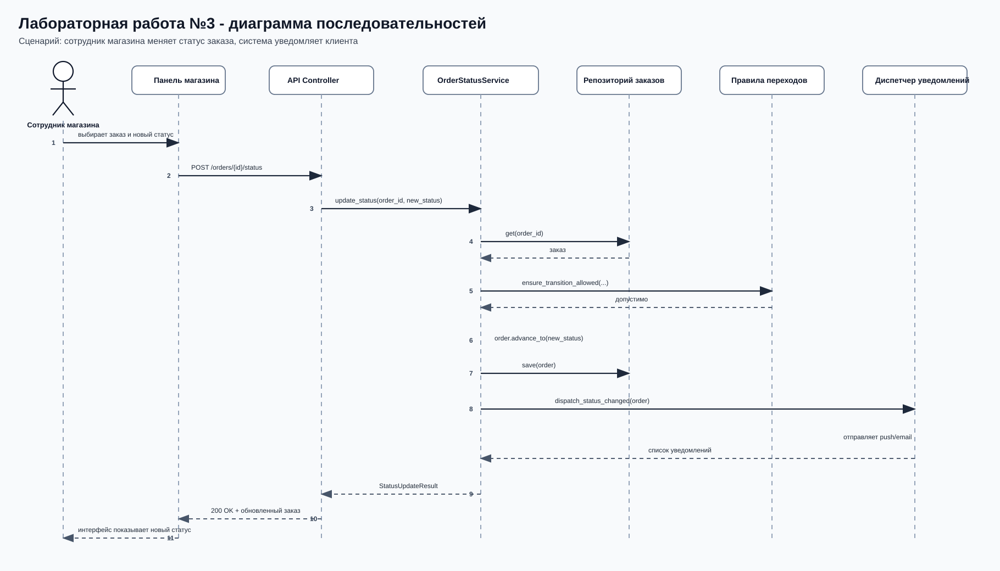
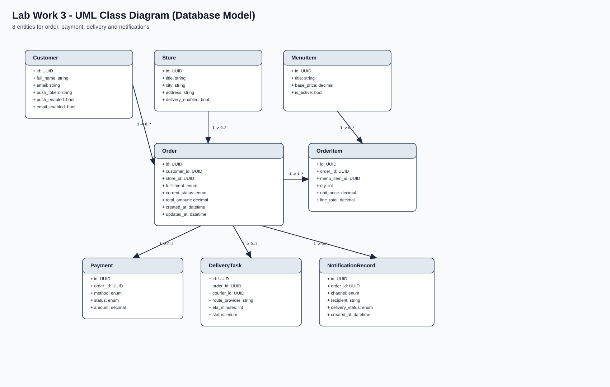

# Лабораторная работа №3

**Тема:** Использование принципов проектирования на уровне методов и классов  
**Цель работы:** Показать применение принципов проектирования в учебной реализации сценария управления заказом и клиентскими уведомлениями.

## Выбранный вариант использования

### Название сценария
Изменение статуса заказа и оповещение клиента.

### Место сценария в системе
В работе детализируется серверный поток системы заказов, спроектированной в ЛР2: сотрудник магазина меняет статус заказа, система проверяет допустимость перехода, сохраняет новое состояние и отправляет клиенту уведомление по доступным каналам.

### Основной актор
Сотрудник магазина.

### Предусловия
- заказ уже создан;
- сотрудник работает через панель магазина;
- для заказа известны контактные данные клиента;
- сервер API доступен.

### Основной сценарий
1. Сотрудник выбирает заказ и новый статус в панели магазина.
2. Панель магазина отправляет команду `POST /orders/{order_id}/status`.
3. HTTP-слой принимает запрос и передает его в прикладной сервис.
4. Сервис получает заказ из репозитория.
5. Компонент доменных правил проверяет допустимость перехода.
6. Заказ переводится в новый статус и сохраняется.
7. Диспетчер уведомлений выбирает доступные каналы и отправляет сообщения клиенту.
8. API возвращает обновленное состояние заказа и список отправленных уведомлений.

### Постусловия
- новый статус заказа сохранен;
- история статусов обновлена;
- клиент получил уведомление по тем каналам, которые доступны для заказа;
- API вернул актуальное состояние заказа.

## Архитектурная основа из ЛР2

### Диаграмма контейнеров


Контейнерная схема берется из ЛР2 как архитектурный контекст всей системы. В ЛР3 реализован учебный серверный фрагмент этого контура: прием HTTP-команд, управление жизненным циклом заказа, проверка статусов и отправка уведомлений.

### Диаграмма компонентов контейнера «Сервис заказов»


В выбранном сценарии используются не все компоненты из полной диаграммы ЛР2, а только те, которые реально задействованы в коде ЛР3.

| Компонент | Реализация в ЛР3 | Файл |
|---|---|---|
| `Order API Adapter` | HTTP-слой, принимающий запросы и формирующий JSON-ответ | `src/sandwich_app/server/api.py` |
| `Order Application Service` | Оркестрация сценариев создания заказа и смены статуса | `src/sandwich_app/server/services/order_status_service.py` |
| `Status Workflow Policy` | Проверка допустимых переходов статусов | `src/sandwich_app/server/domain/rules.py` |
| `Order Repository` | Контракт репозитория и его `in-memory` реализация | `src/sandwich_app/server/ports.py`, `src/sandwich_app/server/repositories/in_memory.py` |
| `Order Event Publisher` | Отправка уведомлений после смены статуса | `src/sandwich_app/server/ports.py`, `src/sandwich_app/server/notifications.py` |

Компоненты `Pricing and Promotion Client` и `Delivery Coordinator` присутствуют в полной модели ЛР2, но в выбранном сценарии ЛР3 не участвуют и поэтому в коде не реализуются.

## Диаграмма последовательностей



Диаграмма отражает тот же поток, который реализован в коде:
- актор `Сотрудник магазина` инициирует изменение статуса через панель магазина;
- `ApiHandler.do_POST` принимает команду смены статуса;
- `App.update_status` преобразует входные данные и вызывает прикладной сервис;
- `OrderStatusService.update_status` загружает заказ, валидирует переход, сохраняет состояние и инициирует уведомления;
- `NotificationDispatcherImpl.dispatch_status_changed` формирует список сообщений и отправляет их по доступным каналам.

## Модель данных



В учебной реализации используется `InMemoryOrderRepository`, поэтому эта UML-диаграмма показывает логическую модель целевой БД, а не текущее физическое хранилище во время запуска.

| Сущность | Назначение |
|---|---|
| `Customer` | Хранит контактные данные клиента и настройки каналов уведомления |
| `Store` | Описывает магазин, в котором оформлен заказ |
| `Order` | Центральная сущность со статусом, типом исполнения и суммой |
| `OrderItem` | Хранит состав заказа |
| `MenuItem` | Описывает позицию меню, из которой формируется заказ |
| `Payment` | Отражает выбранный способ оплаты и состояние платежа |
| `DeliveryTask` | Нужна для сценариев доставки и хранения ETA |
| `NotificationRecord` | Хранит журнал отправленных уведомлений |

## Структура реализации

| Файл | Назначение |
|---|---|
| `src/sandwich_app/server/api.py` | HTTP API, преобразование JSON и композиция зависимостей |
| `src/sandwich_app/server/services/order_status_service.py` | Прикладной сценарий создания заказа и смены статуса |
| `src/sandwich_app/server/domain/models.py` | Доменные сущности заказа, клиента и статусов |
| `src/sandwich_app/server/domain/rules.py` | Таблица допустимых переходов и доменная валидация |
| `src/sandwich_app/server/ports.py` | Абстракции репозитория и диспетчера уведомлений |
| `src/sandwich_app/server/repositories/in_memory.py` | Простая `in-memory` реализация репозитория |
| `src/sandwich_app/server/notifications.py` | Шаблоны уведомлений, выбор каналов и отправка |
| `src/sandwich_app/client/mobile_client.py` | Тонкий HTTP-клиент для демонстрации и тестового вызова API |
| `src/tests/test_order_status_service.py` | Модульные тесты прикладного сервиса |
| `src/tests/test_api.py` | Интеграционные тесты HTTP API |

## Применённые принципы проектирования

| Принцип | Что означает | Конкретный пример из работы | Как используется |
|---|---|---|---|
| `KISS` | Решение должно оставаться максимально простым и понятным. | `build_http_server()` и `App` в `src/sandwich_app/server/api.py` | Для учебного сценария выбран простой HTTP-сервер на стандартной библиотеке Python без лишнего фреймворка и вспомогательных слоев. |
| `YAGNI` | Нужно реализовывать только то, что требуется текущему сценарию. | В `ApiHandler` реализованы только `/orders`, `/orders/{id}` и `/orders/{id}/status` | В код включены только операции, необходимые для создания заказа, просмотра состояния и смены статуса. |
| `DRY` | Повторяющуюся логику нужно хранить в одном месте. | `ensure_transition_allowed()` в `src/sandwich_app/server/domain/rules.py` и `TemplateRenderer` в `src/sandwich_app/server/notifications.py` | Правила переходов и шаблоны уведомлений определены один раз и затем переиспользуются во всем сценарии. |
| `SoC` | Разные задачи системы нужно разделять по отдельным частям. | Модули `api`, `services`, `domain`, `repositories`, `notifications` | HTTP, бизнес-логика, доменные правила, хранение и уведомления вынесены в отдельные части с разными обязанностями. |
| `SRP` | У класса должна быть одна основная ответственность. | `OrderStatusService`, `InMemoryOrderRepository`, `TemplateRenderer`, `ApiHandler` | Каждый класс отвечает только за свой участок: сценарий, хранение, шаблоны уведомлений или HTTP-обработку. |
| `LSP` | Реализацию можно заменить другой реализацией того же контракта без поломки поведения. | `FakeDispatcher` из `src/tests/test_order_status_service.py` подставляется вместо реального диспетчера | Прикладной сервис работает одинаково и с тестовой, и с рабочей реализацией контракта уведомлений. |
| `ISP` | Интерфейсы должны быть маленькими и специализированными. | `OrderRepository` и `NotificationDispatcher` в `src/sandwich_app/server/ports.py` | Сервис зависит только от тех методов, которые ему действительно нужны для работы. |
| `DIP` | Бизнес-логика должна зависеть от абстракций, а не от конкретных классов. | `OrderStatusService(orders: OrderRepository, notifier: NotificationDispatcher)` | Прикладной сервис работает через абстракции, а конкретные реализации подключаются в `App` на границе приложения. |

## Проверка работоспособности

Запуск тестов:

```bash
cd "Lab Work №3/src"
python3 -m unittest discover -s tests -v
```

Запуск сервера:

```bash
cd "Lab Work №3/src"
python3 -m sandwich_app.server.api
```

Запуск демонстрационного клиента:

```bash
cd "Lab Work №3/src"
python3 -m sandwich_app.client.mobile_client
```

## Вывод

В работе разобран и реализован сквозной сценарий смены статуса заказа с уведомлением клиента. Архитектурный контекст взят из ЛР2, а в коде ЛР3 показано, как этот сценарий раскладывается на HTTP-слой, прикладной сервис, доменные правила, репозиторий и подсистему уведомлений. Применённые принципы проектирования подтверждаются конкретными модулями и зависимостями из реализации.
