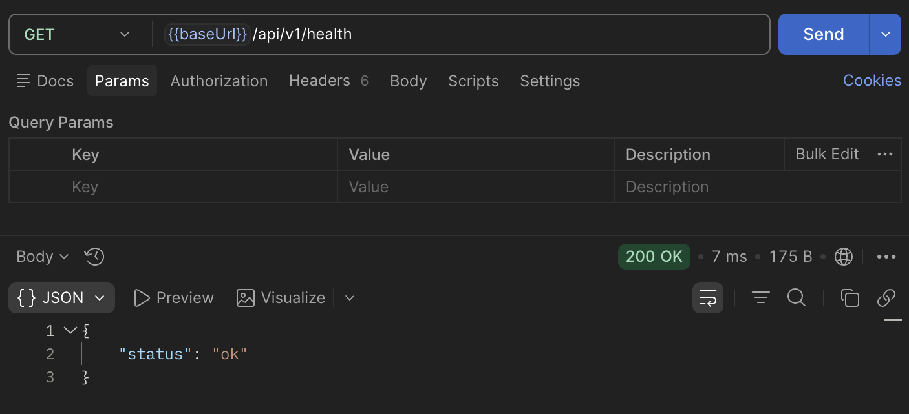
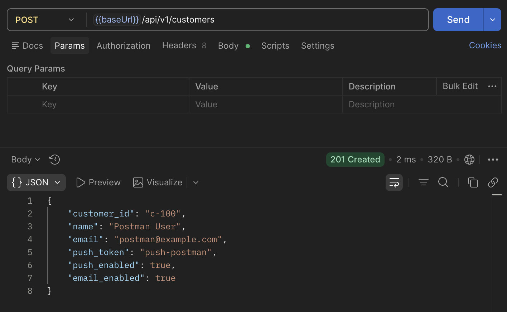
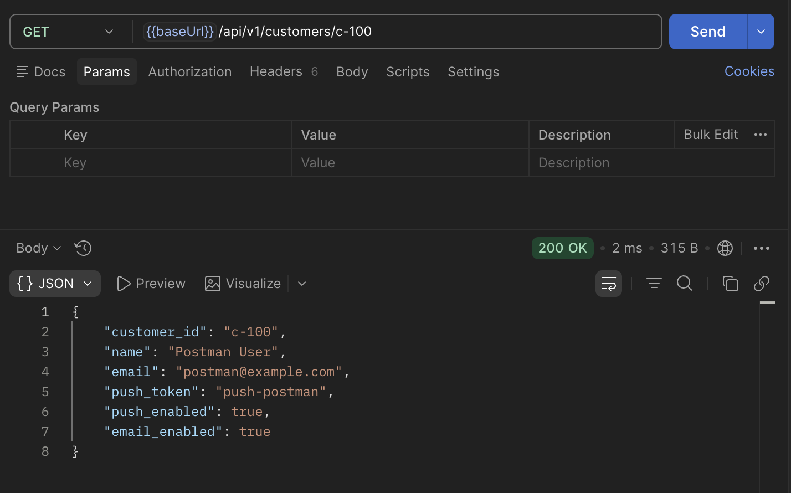
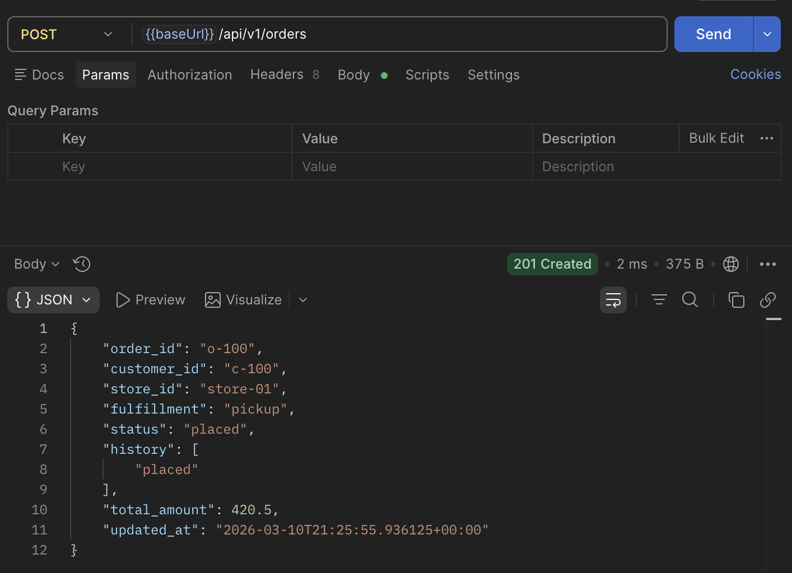
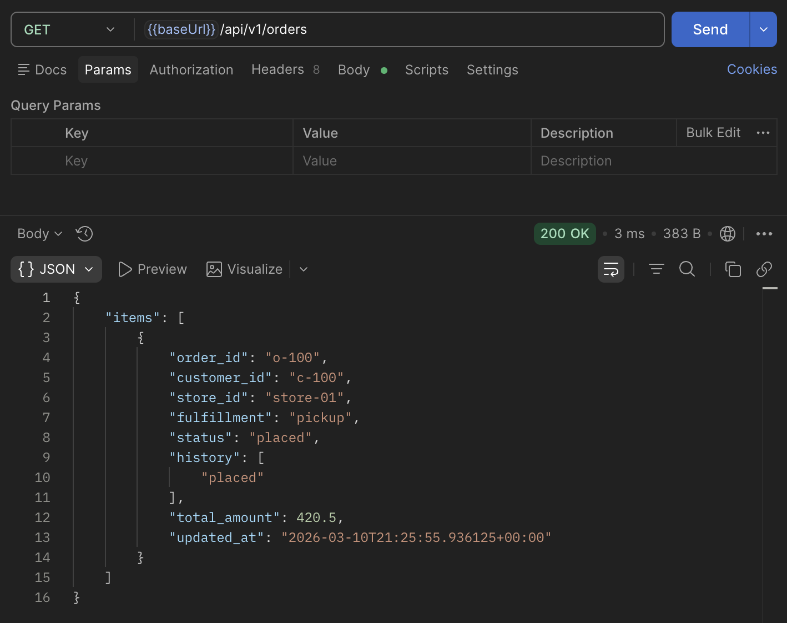
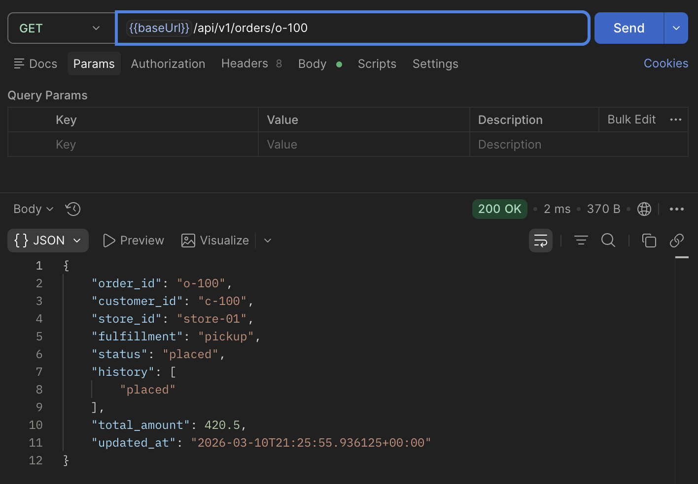
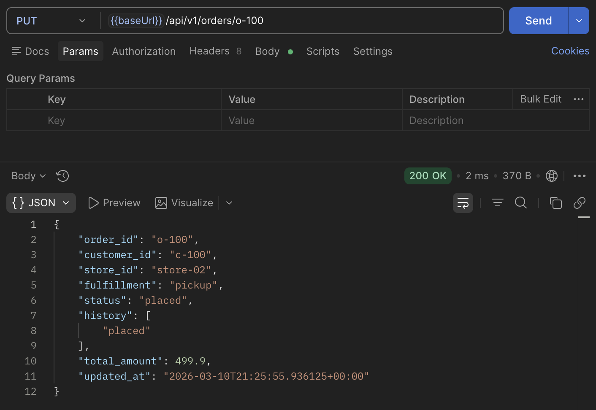
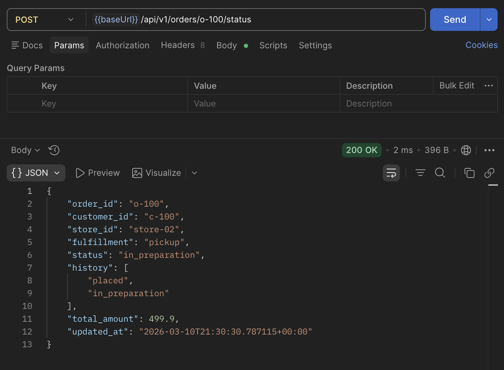
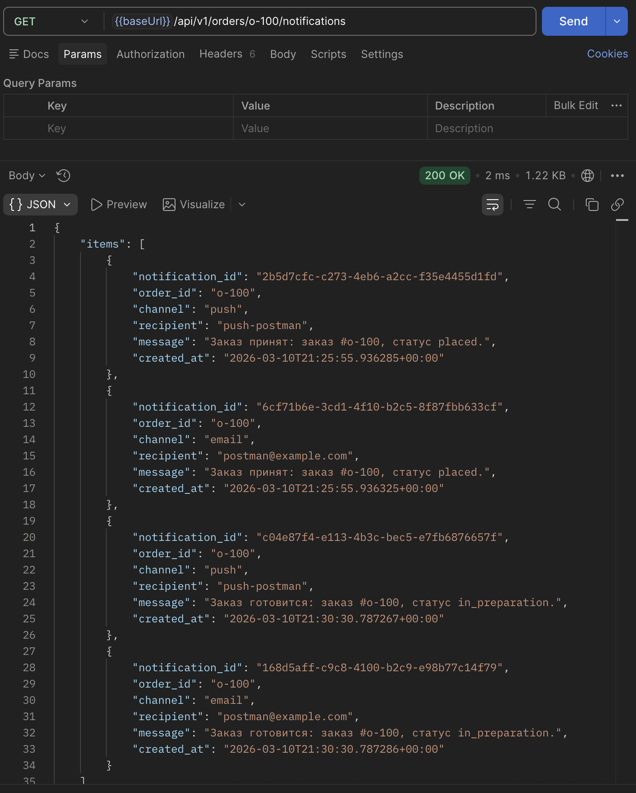
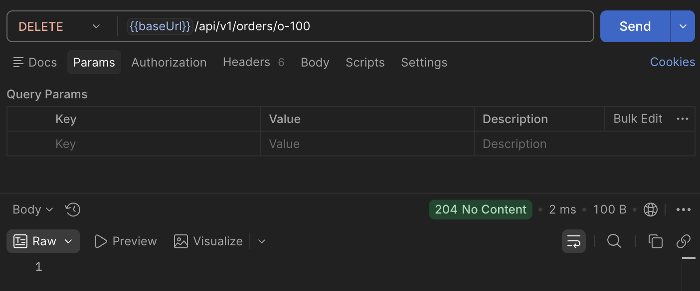

# Лабораторная работа №4

**Тема:** Проектирование REST API  
**Цель работы:** Получить опыт проектирования программного интерфейса.

## Документация по API

### Общие сведения
- Базовый URL: `http://127.0.0.1:8001/api/v1`
- Формат данных: JSON (`application/json; charset=utf-8`)
- Версия API: `v1`
- Аутентификация: не используется
- Единый формат ошибок:

```json
{
  "error": "Текст ошибки"
}
```

### 1. Проверка доступности сервиса

Метод: `GET`  
URL: `/health`

Назначение: проверка работоспособности API.

Параметры запроса: отсутствуют.  
Заголовки запроса: отсутствуют.  
Тело запроса: отсутствует.

Формат ответа: JSON-объект со статусом сервиса.

Образец ответа (`200 OK`):

```json
{
  "status": "ok"
}
```

### 2. Создание клиента

Метод: `POST`  
URL: `/customers`

Назначение: создание карточки клиента для дальнейшего оформления заказов.

Параметры запроса: отсутствуют.  
Заголовки запроса:
- `Content-Type: application/json; charset=utf-8`

Тело запроса (JSON):

```json
{
  "customer_id": "c-100",
  "name": "Postman User",
  "email": "postman@example.com",
  "push_token": "push-postman",
  "push_enabled": true,
  "email_enabled": true
}
```

Формат ответа: JSON-объект с данными созданного клиента.

Образец ответа (`201 Created`):

```json
{
  "customer_id": "c-100",
  "name": "Postman User",
  "email": "postman@example.com",
  "push_token": "push-postman",
  "push_enabled": true,
  "email_enabled": true
}
```

### 3. Получение клиента

Метод: `GET`  
URL: `/customers/{customer_id}`

Назначение: получение данных конкретного клиента.

Параметры запроса:
- `customer_id` (path, обязательный)

Заголовки запроса: отсутствуют.  
Тело запроса: отсутствует.

Формат ответа: JSON-объект клиента.

Образец ответа (`200 OK`):

```json
{
  "customer_id": "c-100",
  "name": "Postman User",
  "email": "postman@example.com",
  "push_token": "push-postman",
  "push_enabled": true,
  "email_enabled": true
}
```

### 4. Создание заказа

Метод: `POST`  
URL: `/orders`

Назначение: создание нового заказа для выбранного клиента.

Параметры запроса: отсутствуют.  
Заголовки запроса:
- `Content-Type: application/json; charset=utf-8`

Тело запроса (JSON):

```json
{
  "order_id": "o-100",
  "customer_id": "c-100",
  "store_id": "store-01",
  "fulfillment": "pickup",
  "total_amount": 420.5
}
```

Формат ответа: JSON-объект заказа.

Образец ответа (`201 Created`):

```json
{
  "order_id": "o-100",
  "customer_id": "c-100",
  "store_id": "store-01",
  "fulfillment": "pickup",
  "status": "placed",
  "history": ["placed"],
  "total_amount": 420.5,
  "updated_at": "2026-03-11T00:00:00+00:00"
}
```

### 5. Получение списка заказов

Метод: `GET`  
URL: `/orders`

Назначение: получение списка заказов с возможностью фильтрации.

Параметры запроса:
- `status` (query, опционально)
- `customer_id` (query, опционально)

Заголовки запроса: отсутствуют.  
Тело запроса: отсутствует.

Формат ответа: JSON-объект с массивом заказов в поле `items`.

Образец ответа (`200 OK`):

```json
{
  "items": [
    {
      "order_id": "o-100",
      "customer_id": "c-100",
      "store_id": "store-01",
      "fulfillment": "pickup",
      "status": "placed",
      "history": ["placed"],
      "total_amount": 420.5,
      "updated_at": "2026-03-11T00:00:00+00:00"
    }
  ]
}
```

### 6. Получение заказа

Метод: `GET`  
URL: `/orders/{order_id}`

Назначение: получение карточки конкретного заказа.

Параметры запроса:
- `order_id` (path, обязательный)

Заголовки запроса: отсутствуют.  
Тело запроса: отсутствует.

Формат ответа: JSON-объект заказа.

Образец ответа (`200 OK`):

```json
{
  "order_id": "o-100",
  "customer_id": "c-100",
  "store_id": "store-01",
  "fulfillment": "pickup",
  "status": "placed",
  "history": ["placed"],
  "total_amount": 420.5,
  "updated_at": "2026-03-11T00:00:00+00:00"
}
```

### 7. Изменение статуса заказа

Метод: `POST`  
URL: `/orders/{order_id}/status`

Назначение: перевод заказа в следующий допустимый статус.

Параметры запроса:
- `order_id` (path, обязательный)

Заголовки запроса:
- `Content-Type: application/json; charset=utf-8`

Тело запроса (JSON):

```json
{
  "status": "in_preparation"
}
```

Формат ответа: JSON-объект заказа с обновленным статусом и историей.

Образец ответа (`200 OK`):

```json
{
  "order_id": "o-100",
  "customer_id": "c-100",
  "store_id": "store-01",
  "fulfillment": "pickup",
  "status": "in_preparation",
  "history": ["placed", "in_preparation"],
  "total_amount": 499.9,
  "updated_at": "2026-03-11T00:05:00+00:00"
}
```

### 8. Получение уведомлений по заказу

Метод: `GET`  
URL: `/orders/{order_id}/notifications`

Назначение: получение списка сформированных уведомлений для заказа.

Параметры запроса:
- `order_id` (path, обязательный)

Заголовки запроса: отсутствуют.  
Тело запроса: отсутствует.

Формат ответа: JSON-объект с массивом уведомлений в поле `items`.

Образец ответа (`200 OK`):

```json
{
  "items": [
    {
      "notification_id": "1f8e6f0b-0e52-4dd6-90cb-8a8ee4564db2",
      "order_id": "o-100",
      "channel": "push",
      "recipient": "push-postman",
      "message": "Заказ готовится: заказ #o-100, статус in_preparation.",
      "created_at": "2026-03-11T00:05:01+00:00"
    }
  ]
}
```

### 9. Обновление параметров заказа

Метод: `PUT`  
URL: `/orders/{order_id}`

Назначение: обновление параметров существующего заказа.

Параметры запроса:
- `order_id` (path, обязательный)

Заголовки запроса:
- `Content-Type: application/json; charset=utf-8`

Тело запроса (JSON):

```json
{
  "total_amount": 499.9,
  "store_id": "store-02",
  "fulfillment": "pickup"
}
```

Формат ответа: JSON-объект обновленного заказа.

Образец ответа (`200 OK`):

```json
{
  "order_id": "o-100",
  "customer_id": "c-100",
  "store_id": "store-02",
  "fulfillment": "pickup",
  "status": "placed",
  "history": ["placed"],
  "total_amount": 499.9,
  "updated_at": "2026-03-11T00:03:00+00:00"
}
```

### 10. Удаление заказа

Метод: `DELETE`  
URL: `/orders/{order_id}`

Назначение: удаление заказа по идентификатору.

Параметры запроса:
- `order_id` (path, обязательный)

Заголовки запроса: отсутствуют.  
Тело запроса: отсутствует.

Формат ответа:
- успешный ответ: `204 No Content` (тело отсутствует);
- при ошибке: JSON-объект ошибки.

Образец ответа при ошибке (`404 Not Found`):

```json
{
  "error": "Заказ o-100 не найден."
}
```

## Тестирование API

### Использованные артефакты
- Postman collection: `docs/postman/LabWork4.postman_collection.json`
- Postman environment: `docs/postman/LabWork4.local.postman_environment.json`
- Сводный прогон HTTP-сценариев: `docs/postman/run_results.json`, `docs/postman/run_results.md`
- Скриншоты Postman: `docs/img/postman/`

### Скриншоты выполненных запросов

| # | Запрос | Скриншот |
|---|---|---|
| 1 | `GET /health` |  |
| 2 | `POST /customers` |  |
| 3 | `GET /customers/{id}` |  |
| 4 | `POST /orders` |  |
| 5 | `GET /orders` |  |
| 6 | `GET /orders/{id}` |  |
| 7 | `PUT /orders/{id}` |  |
| 8 | `POST /orders/{id}/status` |  |
| 9 | `GET /orders/{id}/notifications` |  |
| 10 | `DELETE /orders/{id}` |  |

### Код автотестов в Postman

Образец автотеста статуса ответа:

```javascript
pm.test('Status 200', function () {
  pm.response.to.have.status(200);
});
```

Образец проверки содержимого ответа:

```javascript
const data = pm.response.json();
pm.test('Response contains status field', function () {
  pm.expect(data).to.have.property('status');
});
```

Полный набор автотестов находится в `docs/postman/LabWork4.postman_collection.json`.

## Запуск API и тестов

Запуск сервера:

```bash
cd "Lab Work №4/src"
python3 -m order_api.api
```

Запуск интеграционных тестов:

```bash
cd "Lab Work №4/src"
python3 -m unittest discover -s tests -v
```

## Вывод

Выполнено проектирование и реализация REST API сервиса заказов с методами `GET`, `POST`, `PUT`, `DELETE`.  
Подготовлена полная документация endpoint'ов с единым форматом описания запросов и ответов, а также оформлены результаты тестирования в Postman и автоматические проверки API.
