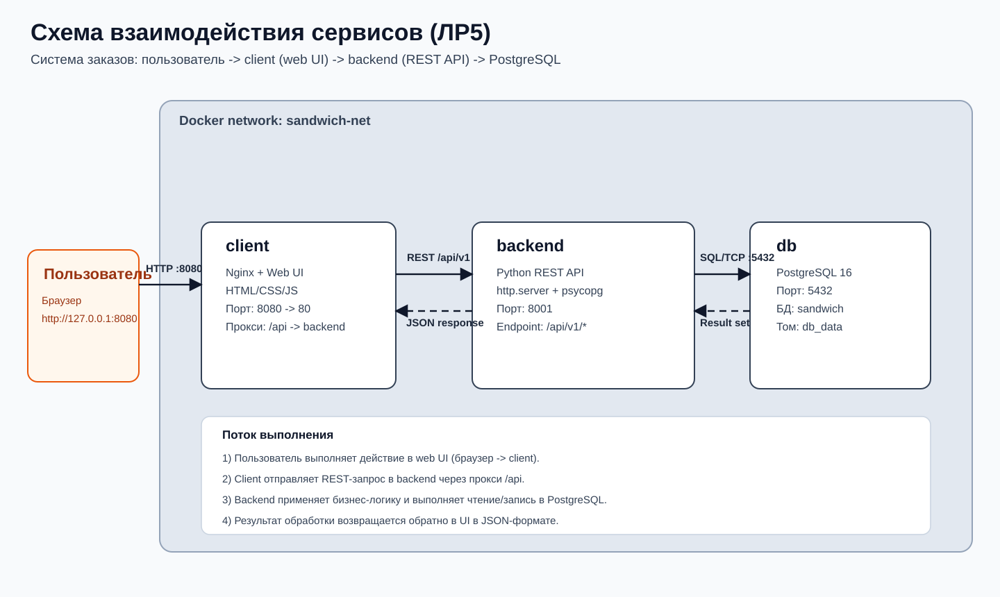
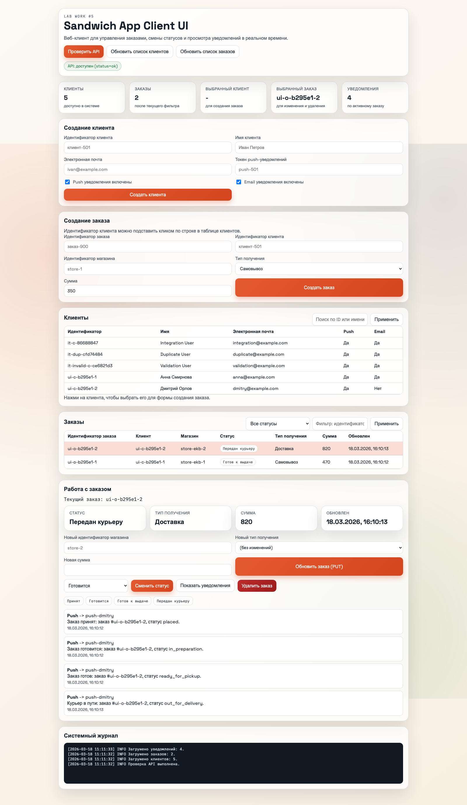

# Лабораторная работа №5

**Тема:** Реализация архитектуры на основе сервисов  
**Цель работы:** Получить опыт развертывания и сопровождения приложения, разделенного на отдельные сервисы, с использованием Docker, PostgreSQL и CI/CD.

## Постановка задачи

В лабораторной работе реализована сервисная система управления заказами сэндвичей.  
Приложение разделено на три контейнера:
- `client` — web-клиент для работы пользователя в браузере;
- `backend` — REST API с бизнес-логикой;
- `db` — PostgreSQL для постоянного хранения клиентов, заказов и уведомлений.

Требуемый результат:
- контейнеризованное приложение, запускаемое через `docker compose`;
- постоянное хранение данных в отдельной БД;
- работающий клиентский интерфейс;
- автоматическая проверка в CI;
- подготовленный pipeline для публикации образов.

## Архитектура решения

Система построена по сервисному принципу: пользователь работает только с web-клиентом, клиент отправляет HTTP-запросы в backend, backend реализует бизнес-логику и взаимодействует с PostgreSQL.

Схема взаимодействия сервисов:



Основной поток работы:
1. Пользователь открывает web-клиент по адресу `http://127.0.0.1:8080`.
2. Nginx отдает статические frontend-файлы и проксирует запросы `/api/*` в backend.
3. Backend принимает REST-запросы, валидирует данные, выполняет операции над заказами и уведомлениями.
4. PostgreSQL сохраняет клиентов, заказы и историю уведомлений.
5. Результат возвращается клиенту и отображается в интерфейсе.

## Состав сервисов

### `client`

Назначение сервиса:
- проверка доступности API;
- просмотр списка клиентов и заказов;
- создание клиентов и заказов;
- обновление заказа;
- смена статуса заказа;
- просмотр уведомлений;
- удаление заказа.

Технологии:
- `nginx:1.27-alpine`;
- статический frontend на `HTML + CSS + JavaScript`.

Особенности реализации:
- все пользовательские действия выполняются из браузера;
- запросы к backend идут через reverse proxy `location /api/`;
- интерфейс отображает реальные данные из PostgreSQL через API.

### `backend`

Назначение сервиса:
- обработка REST API;
- валидация входных данных;
- контроль допустимых переходов статусов;
- создание уведомлений;
- работа с PostgreSQL.

Технологии:
- `python:3.12-slim`;
- стандартный `http.server`;
- драйвер `psycopg`.

Все внешние маршруты backend опубликованы под префиксом `/api/v1`.

Поддерживаемые endpoint'ы:
- `GET /health`
- `GET /customers`
- `POST /customers`
- `GET /customers/{customer_id}`
- `GET /orders`
- `POST /orders`
- `GET /orders/{order_id}`
- `PUT /orders/{order_id}`
- `POST /orders/{order_id}/status`
- `GET /orders/{order_id}/notifications`
- `DELETE /orders/{order_id}`

Бизнес-правила:
- клиент должен существовать до оформления заказа;
- `fulfillment` может быть только `pickup` или `delivery`;
- сумма заказа не может быть отрицательной;
- поле `updated_at` обновляется при изменении заказа;
- при создании заказа и при каждой корректной смене статуса формируются уведомления;
- переходы статусов зависят от типа получения заказа.

### `db`

Назначение сервиса:
- постоянное хранение данных;
- обеспечение ссылочной целостности;
- выполнение ограничений на уровне БД.

Технологии:
- `postgres:16-alpine`.

Основные таблицы:
- `customers`
- `orders`
- `notifications`

Реализованные ограничения:
- первичные ключи для клиентов, заказов и уведомлений;
- внешние ключи `orders.customer_id -> customers.customer_id` и `notifications.order_id -> orders.order_id`;
- `CHECK` для непустых идентификаторов и имени клиента;
- `CHECK` для допустимых значений `fulfillment` и `status`;
- `CHECK (total_amount >= 0)`.

Дополнительно созданы индексы:
- по `orders.customer_id`;
- по `orders.status`;
- по `orders.updated_at`;
- по `notifications.order_id`.

## Контейнеризация

### Dockerfile backend

Backend собирается из образа `python:3.12-slim`.

Последовательность:
1. создается рабочая директория `/app`;
2. копируется `requirements.txt`;
3. устанавливаются Python-зависимости;
4. копируется приложение `app/`;
5. запускается `python -m app.api`.

### Dockerfile client

Клиент собирается из образа `nginx:1.27-alpine`.

Последовательность:
1. копируется конфигурация `nginx.conf`;
2. копируются frontend-файлы в `/usr/share/nginx/html`;
3. сервис публикует web-интерфейс на порту `80` внутри контейнера.

### docker-compose.yml

В `docker-compose.yml` описаны три сервиса:
- `db`
- `backend`
- `client`

Настроены:
- общая сеть `sandwich-net`;
- том `db_data` для постоянного хранения базы;
- публикация портов `5432`, `8001`, `8080`;
- ожидание готовности через `healthcheck` и `depends_on` с `condition: service_healthy`.

`healthcheck` выполняет:
- для `db` — `pg_isready`;
- для `backend` — запрос `GET /api/v1/health`;
- для `client` — проверку ответа Nginx на `/`.

## Проверка работоспособности

### Сборка и запуск

```bash
docker compose -f "Lab Work №5/docker-compose.yml" build
docker compose -f "Lab Work №5/docker-compose.yml" up -d
```

### Проверка backend

```bash
curl http://127.0.0.1:8001/api/v1/health
```

Ожидаемый ответ:

```json
{
  "status": "ok",
  "database": "ok"
}
```

### Проверка client

```bash
curl -I http://127.0.0.1:8080
```

Ожидается ответ `HTTP/1.1 200 OK`, после чего web-клиент доступен в браузере.

### Проверка PostgreSQL

```bash
docker compose -f "Lab Work №5/docker-compose.yml" exec db \
  psql -U sandwich -d sandwich \
  -c "SELECT order_id, status, total_amount FROM orders ORDER BY updated_at DESC;"
```

Эта команда подтверждает, что backend записывает данные в постоянную БД, а не хранит их только в памяти процесса.

## Демонстрация клиентского интерфейса

Ниже показан запущенный web-клиент с уже созданными клиентами, заказами, выбранным заказом, историей статусов, уведомлениями и системным журналом:



На экране видно:
- карточки состояния с количеством клиентов, заказов и уведомлений;
- таблицу клиентов;
- таблицу заказов;
- выбранный заказ и его основные параметры;
- историю смены статусов;
- уведомления, сформированные backend;
- журнал пользовательских операций.

## Интеграционные тесты

Тесты расположены в `Lab Work №5/integration_tests/test_api_integration.py`.

Проверяемые сценарии:
- доступность `GET /health` и соединение backend с PostgreSQL;
- конфликт при повторном создании клиента;
- полный CRUD-сценарий по заказу с проверкой записи в БД;
- отклонение некорректных запросов и отсутствие ошибочных записей в PostgreSQL.

Локальный запуск:

```bash
pip install -r "Lab Work №5/integration_tests/requirements.txt"
pytest -q "Lab Work №5/integration_tests/test_api_integration.py"
```

При фактическом локальном прогоне получен результат: `4 passed`.

Запуск через отдельный контейнер:

```bash
docker compose -f "Lab Work №5/docker-compose.yml" up -d db backend
docker run --rm \
  --network labwork5_sandwich-net \
  -v "$PWD/Lab Work №5/integration_tests:/tests" \
  python:3.12-slim \
  sh -lc "pip install --no-cache-dir -r /tests/requirements.txt && BASE_URL=http://backend:8001/api/v1 POSTGRES_DSN='postgresql://sandwich:sandwich@db:5432/sandwich?sslmode=disable' pytest -q /tests/test_api_integration.py"
docker compose -f "Lab Work №5/docker-compose.yml" down -v
```

## Непрерывная интеграция и развертывание

Workflow расположен в `.github/workflows/lab5-ci-cd.yml`.

### Job `ci`

Выполняет:
1. checkout репозитория;
2. установку Python 3.12;
3. установку зависимостей интеграционных тестов;
4. сборку docker-образов;
5. запуск `db`, `backend`, `client`;
6. ожидание готовности backend через `/api/v1/health`;
7. запуск `pytest`;
8. вывод логов и остановку контейнеров.

### Job `publish-images`

Выполняется только при:
- событии `push`;
- ветке `main`;
- наличии секретов `DOCKERHUB_USERNAME` и `DOCKERHUB_TOKEN`.

Публикуемые образы:
- `${DOCKERHUB_USERNAME}/sandwich-backend`
- `${DOCKERHUB_USERNAME}/sandwich-client`

Публикуемые теги:
- `latest`
- `sha-<commit>`

## Итог

В лабораторной работе реализовано контейнеризированное сервисное приложение с разделением на клиент, backend и базу данных PostgreSQL.  
Backend перенесен на постоянное хранение, клиент работает через отдельный контейнер Nginx, а запуск всех сервисов организован через `docker compose`.  
Подготовлены интеграционные тесты, healthchecks и workflow CI/CD, что делает решение не только работоспособным локально, но и пригодным для автоматической проверки и публикации образов.
