# Лабораторная работа №6

**Тема:** Использование шаблонов проектирования  
**Цель работы:** Показать применение шаблонов GoF и принципов GRASP в коде предметной области системы заказов и уведомлений.

## Постановка задачи

В работе используется предметная область предыдущих лабораторных: оформление заказа, расчет итоговой суммы, смена статуса и отправка уведомлений клиенту.  
Для ЛР6 реализован отдельный учебный модуль `src/sandwich_lab6`, в котором один сквозной сценарий разложен на набор паттернов проектирования.

Требуемый результат:
- реализовать набор шаблонов GoF в реальном коде, а не в изолированных примерах;
- показать роли классов по GRASP;
- подтвердить работу кода демонстрационным сценарием и автотестами.

## Контекст реализации

Модуль состоит из следующих частей:

| Модуль | Назначение |
| --- | --- |
| `domain.py` | Доменные сущности заказа, клиента, события и уведомления |
| `ports.py` | Абстракции репозиториев и канала уведомлений |
| `creational.py` | Порождающие паттерны: `Singleton`, `Builder`, `Factory Method` |
| `structural.py` | Структурные паттерны: `Adapter`, `Decorator`, `Proxy` |
| `behavioral.py` | Поведенческие паттерны: `Strategy`, `Observer`, `State`, `Command`, `Chain of Responsibility` |
| `facade.py` | Фасад прикладного сценария жизненного цикла заказа |
| `bootstrap.py` | Сборка объектов и связей между ними |
| `demo.py` | Демонстрационный запуск сквозного сценария |

## Сквозной сценарий

В коде реализован один цельный поток работы:

1. `build_context()` собирает конфигурацию, репозитории, publisher, observer, фасад и командную шину.
2. `CreateOrderCommand` передает в фасад `OrderBuilder`, который пошагово собирает `Order`.
3. `OrderManagementFacade.create_order()` валидирует заказ через цепочку обработчиков.
4. В зависимости от `pickup` или `delivery` выбирается стратегия расчета итоговой суммы.
5. После сохранения заказа `OrderEventPublisher` публикует событие, а `NotificationObserver` отправляет уведомления через адаптеры каналов.
6. `ChangeStatusCommand` изменяет статус заказа через `OrderStateMachine`, после чего снова публикуется событие и формируются уведомления.

Именно вокруг этого сценария и используются все заявленные паттерны.

## Шаблоны GoF

### Порождающие шаблоны

| Шаблон | Что означает | Где реализован | Как используется в работе |
| --- | --- | --- | --- |
| `Singleton` | Гарантирует единственный экземпляр объекта | `AppConfig` в `creational.py` | Все сценарии используют один объект конфигурации с `delivery_fee` и `currency` |
| `Builder` | Собирает сложный объект пошагово | `OrderBuilder` в `creational.py` | Заказ создается через цепочку `with_order_id()`, `with_customer_id()`, `with_store_id()`, `with_amount()` |
| `Factory Method` | Делегирует создание конкретного объекта подклассам | `NotificationChannelCreator`, `EmailChannelCreator`, `PushChannelCreator` | Подсистема уведомлений создает каналы `email` и `push` без ветвления в фасаде и observer |

#### `Singleton`

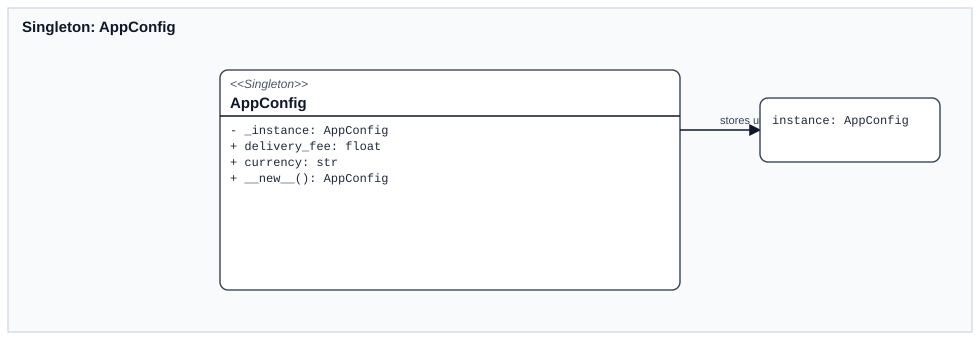

`AppConfig` хранит общие параметры прикладного сценария.  
В ЛР6 singleton нужен не формально, а для одного общего источника настроек, откуда фасад берет стоимость доставки.

#### `Builder`

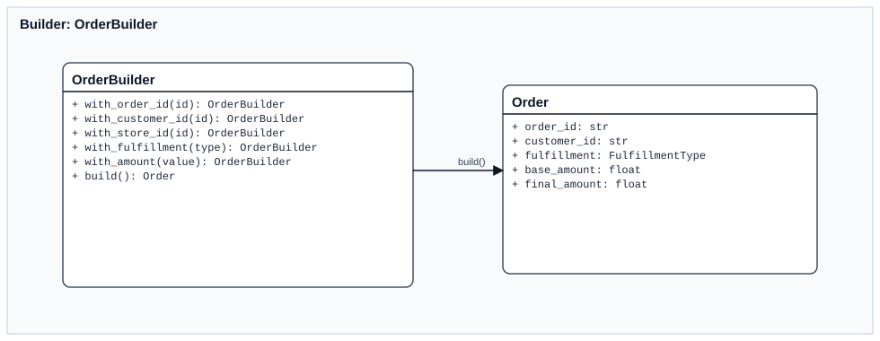

`OrderBuilder` собирает заказ по шагам и не позволяет создать объект без обязательных полей.  
Это подтверждается и кодом, и тестом `test_builder_requires_required_fields`.

#### `Factory Method`

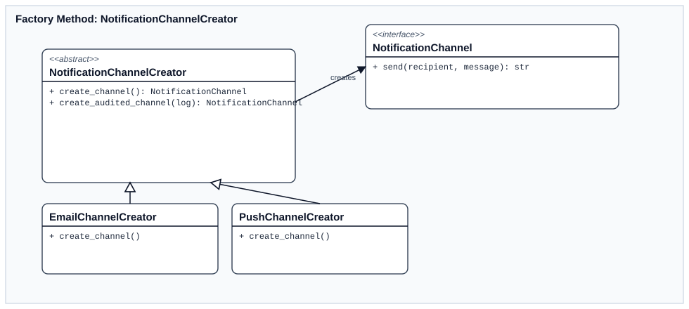

Фабричный метод используется для выбора конкретного канала уведомления.  
Observer получает список creators и работает с ними единообразно, не зная деталей `EmailGatewayAdapter` и `PushGatewayAdapter`.

### Структурные шаблоны

| Шаблон | Что означает | Где реализован | Как используется в работе |
| --- | --- | --- | --- |
| `Adapter` | Приводит несовместимый интерфейс к нужному контракту | `EmailGatewayAdapter`, `PushGatewayAdapter` в `structural.py` | Legacy SDK каналов приводятся к общему интерфейсу `send(recipient, message)` |
| `Decorator` | Добавляет поведение объекту без изменения его класса | `AuditNotificationDecorator` в `structural.py` | Перед и после отправки уведомления в аудит пишутся записи `before/after` |
| `Proxy` | Контролирует доступ к другому объекту | `CustomerRepositoryCacheProxy` в `structural.py` | Кэширует клиентов и считает `cache_hits` |
| `Facade` | Дает один упрощенный интерфейс к набору подсистем | `OrderManagementFacade` в `facade.py` | Через фасад выполняются все прикладные операции: создание заказа, смена статуса, просмотр клиентов и заказов |

#### `Adapter`

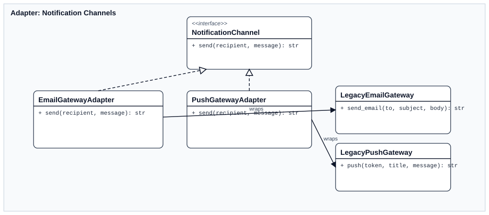

Адаптеры нужны потому, что legacy email и push gateway имеют разные сигнатуры вызова.  
После адаптации observer и decorator работают с ними через один и тот же контракт.

#### `Decorator`

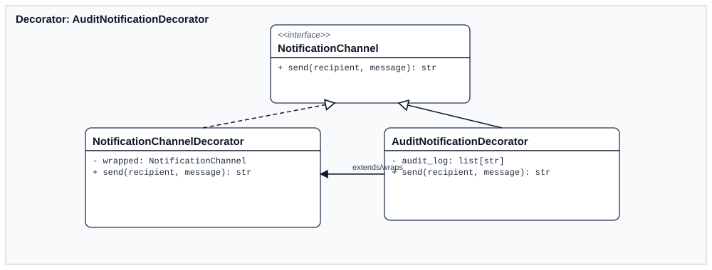

`AuditNotificationDecorator` оборачивает любой канал уведомлений и добавляет аудит.  
Сам канал при этом не меняется, а дополнительное поведение подключается поверх него.

#### `Proxy`

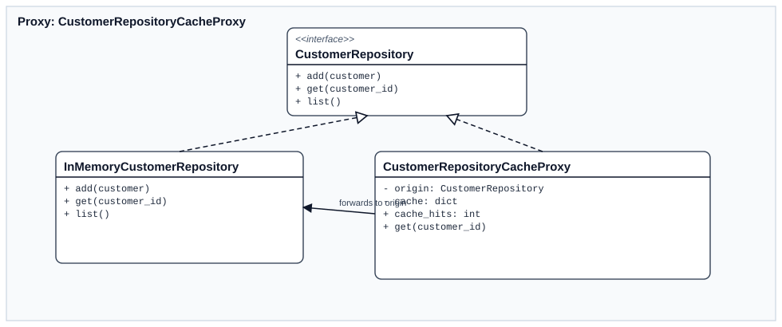

`CustomerRepositoryCacheProxy` стоит перед репозиторием клиентов и сохраняет уже прочитанные записи в локальном кеше.  
Это видно в тесте `test_list_customers_and_proxy_cache`, где повторный запрос дает рост `cache_hits`.

#### `Facade`

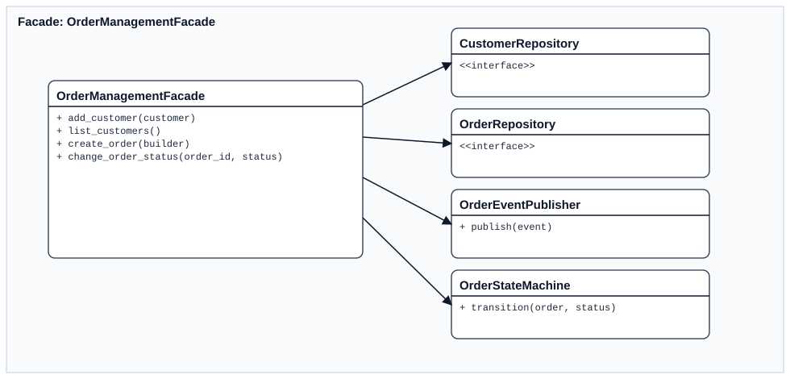

`OrderManagementFacade` объединяет репозитории, state machine, publisher и стратегии расчета.  
Именно этот объект выступает основной точкой входа в прикладной сценарий.

### Поведенческие шаблоны

| Шаблон | Что означает | Где реализован | Как используется в работе |
| --- | --- | --- | --- |
| `Strategy` | Позволяет менять алгоритм через взаимозаменяемые реализации | `PickupPricingStrategy`, `DeliveryPricingStrategy` | Итоговая сумма зависит от типа получения заказа |
| `Observer` | Подписчики получают уведомление о событии издателя | `OrderEventPublisher`, `NotificationObserver` | После создания заказа и смены статуса автоматически рассылаются уведомления |
| `State` | Поведение зависит от текущего состояния объекта | `OrderStateMachine` и классы состояний | Разрешенные переходы статусов определяются текущим состоянием заказа |
| `Command` | Запрос представляется отдельным объектом | `CreateOrderCommand`, `ChangeStatusCommand`, `CommandBus` | Создание заказа и смена статуса выполняются единообразно через командную шину |
| `Chain of Responsibility` | Запрос проходит по цепочке обработчиков | `CustomerExistsValidator`, `PositiveAmountValidator`, `StatusTransitionValidator` | Проверки заказа разбиты на независимые валидаторы |

#### `Strategy`

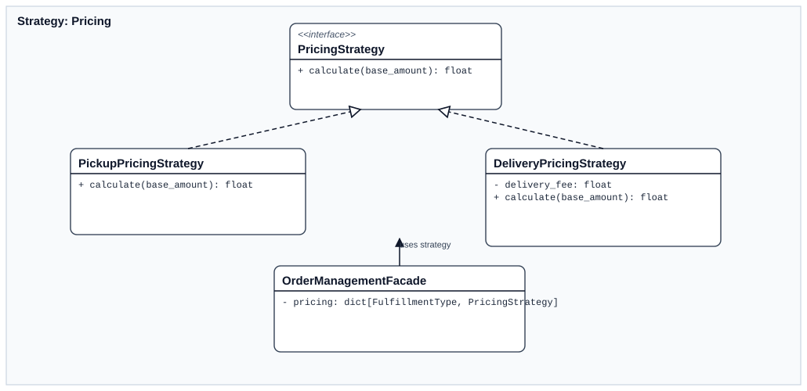

Стратегии расчета цены нужны для двух вариантов выдачи заказа:
- `PickupPricingStrategy` оставляет сумму без изменений;
- `DeliveryPricingStrategy` добавляет `delivery_fee` из `AppConfig`.

Тест `test_delivery_order_uses_delivery_strategy` подтверждает, что для доставки сумма меняется.

#### `Observer`

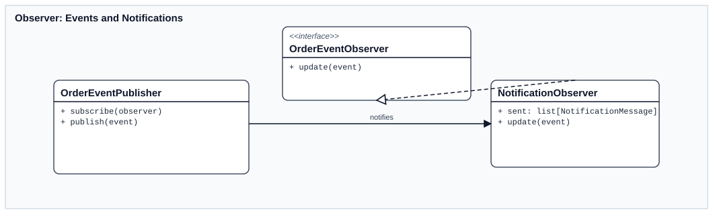

Publisher сообщает о событиях заказа, а `NotificationObserver` реагирует на них и создает сообщения по доступным каналам.  
В результате отправка уведомлений не встраивается прямо в фасад и отделена от основного сценария.

#### `State`

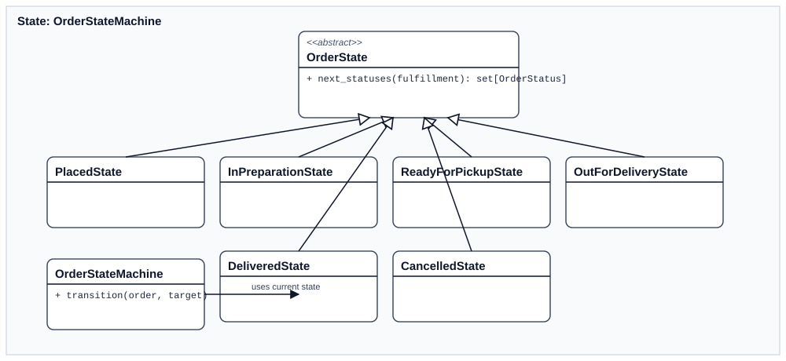

`OrderStateMachine` хранит набор объектов-состояний и спрашивает у них допустимые переходы.  
Для `pickup` и `delivery` правила различаются, что и делает использование состояния здесь оправданным.

#### `Command`

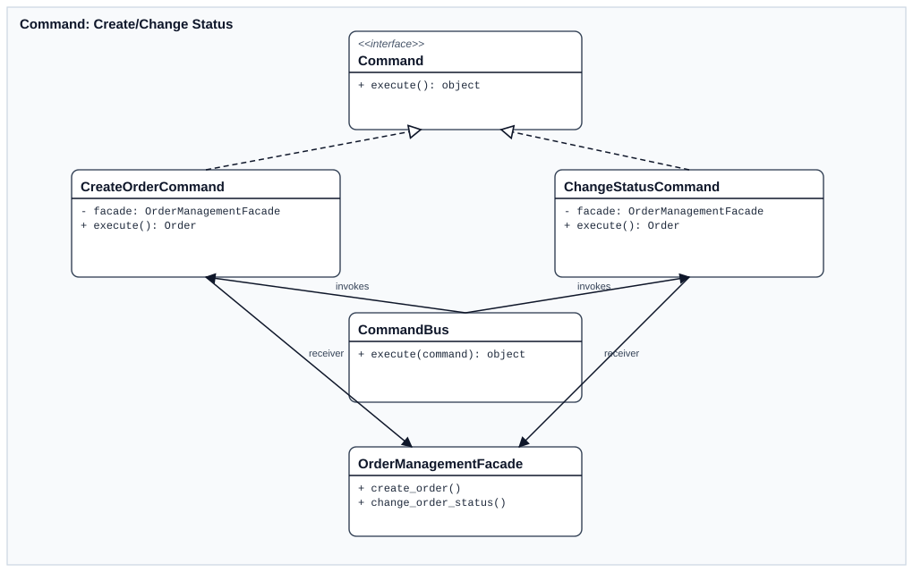

Команды инкапсулируют операции `создать заказ` и `сменить статус`.  
`CommandBus` выполняет команды единообразно и поддерживает hook `after_execute`, что проверяется тестом `test_command_bus_calls_after_execute_hook`.

#### `Chain of Responsibility`

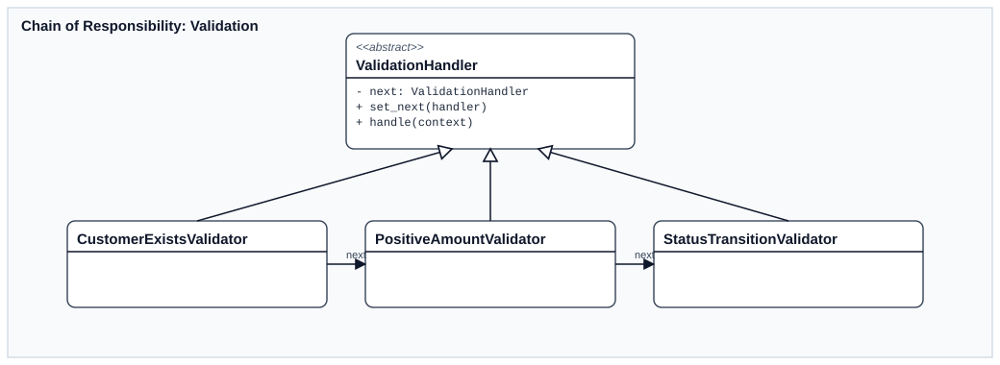

При создании и изменении заказа проверки не смешаны в одном большом методе.  
Каждая проверка вынесена в отдельный validator, а цепочка собирается фасадом под нужный сценарий.

## Применение GRASP

### Роли классов

| Роль | Что означает | Пример в коде | Как проявляется в ЛР6 |
| --- | --- | --- | --- |
| `Information Expert` | Ответственность получает тот объект, который владеет нужными данными и правилами | `OrderStateMachine`, `OrderState` | Правила переходов статусов сосредоточены рядом с состояниями заказа |
| `Creator` | Создавать объект должен тот, кто обладает всей нужной информацией для его сборки | `OrderBuilder` | Builder собирает `Order`, потому что хранит все части будущего объекта |
| `Controller` | Один объект принимает системные команды и запускает сценарий | `OrderManagementFacade` | Фасад принимает команды прикладного уровня и координирует остальные объекты |
| `Polymorphism` | Разные варианты поведения оформляются разными реализациями, а не `if/else` везде | `PricingStrategy`, `OrderState` | Расчет суммы и правила переходов меняются через полиморфные классы |
| `Pure Fabrication` | Техническая обязанность выносится в отдельный сервисный класс, чтобы не засорять доменную модель | `EmailGatewayAdapter`, `PushGatewayAdapter`, `NotificationObserver` | Интеграция каналов и рассылка не помещены внутрь `Order` и `Customer` |

### Принципы разработки

| Принцип | Что означает | Пример в коде | Результат |
| --- | --- | --- | --- |
| `Low Coupling` | Компоненты должны зависеть друг от друга как можно слабее | `CustomerRepository`, `OrderRepository`, `NotificationChannel` в `ports.py` | Фасад и observer работают через абстракции, а конкретные реализации можно заменить |
| `High Cohesion` | У класса должна быть одна понятная группа обязанностей | отдельные классы для `Strategy`, `State`, `Validator`, `Adapter` | Логика расчета, переходов, валидации и интеграции не смешана в одном месте |
| `Protected Variations` | Потенциально изменяемые части нужно изолировать за стабильным интерфейсом | creators каналов, стратегии цены, интерфейс observer | Добавление нового канала, новой стратегии или нового observer не требует переписывать весь сценарий |

## Свойство программы

### Расширяемость

Расширяемость здесь является не абстрактной целью, а прямым следствием выбранной архитектуры.

Конкретные примеры:
- чтобы добавить новый канал уведомлений, достаточно реализовать новый `NotificationChannelCreator` и адаптер;
- чтобы добавить новый алгоритм расчета цены, достаточно добавить новую реализацию `PricingStrategy`;
- чтобы добавить новую проверку создания заказа, достаточно включить новый handler в цепочку валидации;
- чтобы добавить новую реакцию на событие заказа, достаточно подписать нового observer на publisher.

## Проверка работоспособности

### Демонстрационный запуск

```bash
cd "Lab Work №6"
PYTHONPATH=src python3 -m sandwich_lab6.demo
```

Фактический вывод:

```text
Создан заказ: o-600, итоговая сумма: 450.0
Статус заказа: in_preparation, история: ['placed', 'in_preparation']
Отправленные уведомления:
- push -> push-postman: Заказ #o-600 создан со статусом placed.
- email -> postman@example.com: Заказ #o-600 создан со статусом placed.
- push -> push-postman: Заказ #o-600 переведен в статус in_preparation.
- email -> postman@example.com: Заказ #o-600 переведен в статус in_preparation.
Аудит каналов: ['before:push:push-postman', 'after:push:push-postman', 'before:email:postman@example.com', 'after:email:postman@example.com', 'before:push:push-postman', 'after:push:push-postman', 'before:email:postman@example.com', 'after:email:postman@example.com']
```

Этот запуск подтверждает сквозной сценарий:
- заказ создается через builder и command;
- сумма считается через strategy;
- статус меняется через state machine;
- observer публикует уведомления;
- decorator фиксирует аудит каналов.

### Автотесты

```bash
cd "Lab Work №6"
python3 -m unittest discover -s tests -v
```

Проверяемые сценарии:
- singleton-конфигурация;
- обязательные поля builder;
- proxy-кеш репозитория клиентов;
- создание заказа через command + builder + strategy + observer;
- расчет суммы для доставки;
- корректная смена статуса;
- блокировка недопустимого перехода;
- decorator-аудит;
- factory method для каналов уведомлений;
- hook в command bus.

При фактическом прогоне получен результат:

```text
Ran 10 tests in 0.001s

OK
```

Дополнительно `pytest` также подтверждает корректность набора тестов:

```text
10 passed in 0.01s
```

## Вывод

В лабораторной работе реализован учебный модуль `sandwich_lab6`, где жизненный цикл заказа построен на реальном сочетании GoF-паттернов: `Singleton`, `Builder`, `Factory Method`, `Adapter`, `Decorator`, `Proxy`, `Facade`, `Strategy`, `Observer`, `State`, `Command`, `Chain of Responsibility`.  
Роли классов и архитектурные решения дополнительно объяснены через GRASP и принципы `Low Coupling`, `High Cohesion`, `Protected Variations`.  
Работа подтверждена демонстрационным сценарием и автотестами, поэтому модуль не только иллюстрирует паттерны, но и показывает их совместную работу в одном прикладном процессе.
