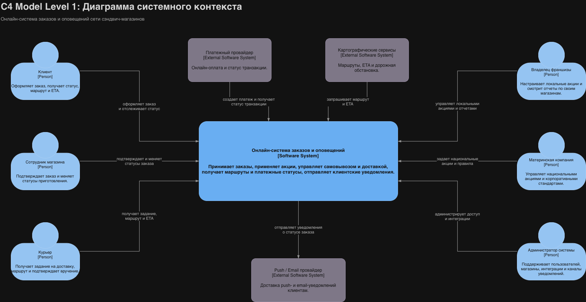
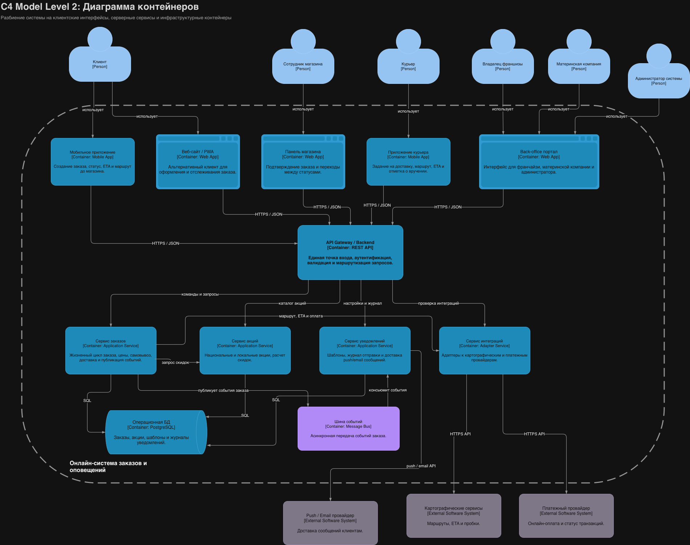
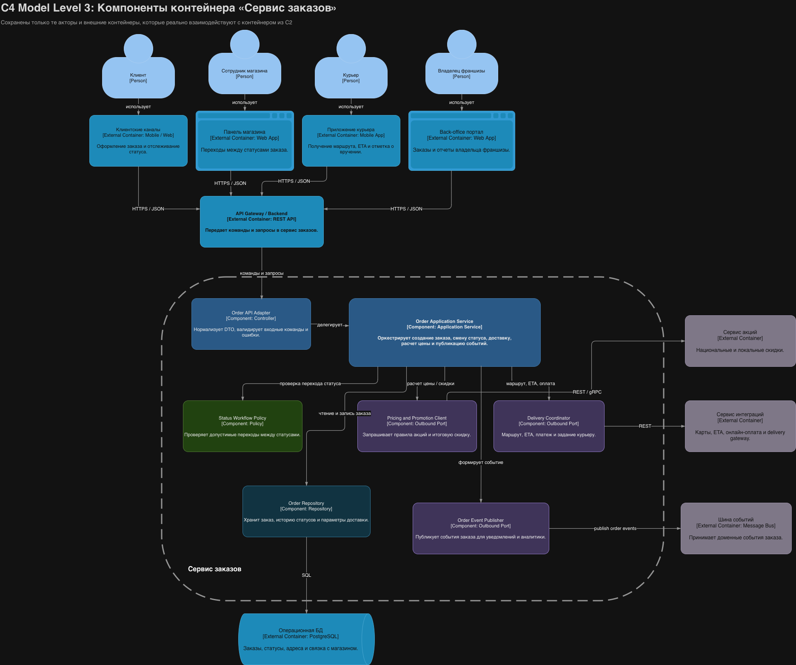
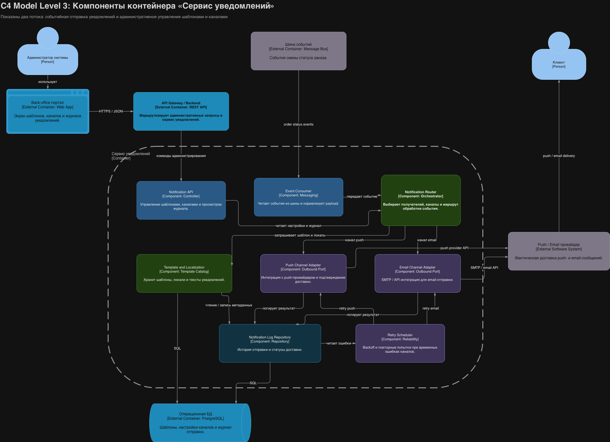

# Лабораторная работа №2

**Тема:** Использование нотации C4 Model для проектирования архитектуры программной системы  
**Цель работы:** Зафиксировать архитектурные решения системы заказов в согласованном наборе диаграмм C4.

Редактируемые исходники диаграмм для `draw.io`:
- `c4_1_context.drawio`
- `c4_2_containers.drawio`
- `c4_3_components_orders.drawio`
- `c4_4_components_notify.drawio`

Финальные диаграммы для отчёта экспортированы в `img/*.png`.

## Диаграмма системного контекста (C1)

### Основные элементы контекста

- **Клиент** оформляет заказ, оплачивает его онлайн или при получении, отслеживает статус, маршрут и ETA.
- **Сотрудник магазина** подтверждает заказ и переводит его между производственными статусами.
- **Курьер** получает доставку, маршрут и подтверждает факт вручения.
- **Владелец франшизы** работает с локальными акциями и анализирует заказы своих магазинов.
- **Материнская компания** задает национальные акции, стандарты сети и корпоративные правила.
- **Администратор системы** поддерживает пользователей, магазины, интеграции и каналы уведомлений.
- **Онлайн-система заказов и оповещений** находится в фокусе моделирования и объединяет оформление заказа, скидки, доставку, маршруты, платежи и уведомления.
- **Внешние системы**: платежный провайдер, картографические сервисы, push/email провайдер.

## Диаграмма контейнеров (C2)

### Контейнеры пользовательского уровня

- **Мобильное приложение** и **веб-сайт / PWA** дают клиенту два канала оформления заказа и отслеживания статуса.
- **Панель магазина** используется сотрудником для подтверждения заказа и смены статусов.
- **Приложение курьера** используется для доставки, получения маршрута и фиксации завершения доставки.
- **Back-office портал** является ролевым интерфейсом для франчайзи, материнской компании и администратора.

### Серверные контейнеры

- **API Gateway / Backend** выступает единой точкой входа для клиентских и административных интерфейсов.
- **Сервис заказов** отвечает за жизненный цикл заказа, цены, самовывоз, доставку и публикацию событий.
- **Сервис акций** хранит и применяет локальные и национальные скидочные правила.
- **Сервис уведомлений** управляет шаблонами, журналом отправки и доставкой push/email сообщений.
- **Сервис интеграций** инкапсулирует вызовы к картографическим и платежным провайдерам.

### Инфраструктурные контейнеры

- **Операционная БД** хранит заказы, акции, шаблоны уведомлений и журналы.
- **Шина событий** передает события смены статусов заказа в асинхронном режиме.

## Выбранный архитектурный стиль

Выбрана **модульная сервисная архитектура на уровне контейнеров**:
- выделены отдельные сервисы для заказов, акций, уведомлений и интеграций;
- пользовательские и административные интерфейсы изолированы от внутренней бизнес-логики через единый API Gateway;
- события заказа передаются в сервис уведомлений через шину событий, что уменьшает связность и повышает отказоустойчивость;
- интеграции с картами и платежами вынесены в отдельный контейнер, поэтому замена внешнего провайдера не затрагивает бизнес-логику заказа;
- роли франчайзи, материнской компании и администратора сведены к отдельному интерфейсному контейнеру, а не смешаны с клиентскими каналами.

## Диаграмма компонентов (C3): контейнер «Сервис заказов»

### Компоненты сервиса заказов

- **Order API Adapter** принимает команды и запросы от `API Gateway / Backend`.
- **Order Application Service** оркестрирует основные сценарии: создание заказа, смену статуса, расчет доставки и публикацию событий.
- **Status Workflow Policy** проверяет допустимость переходов между статусами.
- **Pricing and Promotion Client** обращается к сервису акций за правилами скидок.
- **Delivery Coordinator** работает с внешним сервисом интеграций для оплаты, маршрута и ETA.
- **Order Repository** сохраняет состояние заказа и историю статусов в БД.
- **Order Event Publisher** публикует события заказа в шину событий для последующих уведомлений.

## Диаграмма компонентов (C3): контейнер «Сервис уведомлений»

### Компоненты сервиса уведомлений

- **Notification API** обслуживает административные запросы к шаблонам, каналам и журналу уведомлений.
- **Event Consumer** читает события изменения статусов заказа из шины событий.
- **Notification Router** определяет получателей, канал и маршрут обработки события.
- **Template and Localization** хранит шаблоны сообщений и локализацию.
- **Push Channel Adapter** выполняет отправку через push-провайдер.
- **Email Channel Adapter** выполняет отправку email через SMTP/API провайдера.
- **Notification Log Repository** сохраняет историю и статусы отправки.
- **Retry Scheduler** повторяет отправку при временных ошибках внешних каналов.

## Итог
Результатом лабораторной работы является набор согласованных диаграмм C4: системный контекст, контейнеры и две компонентные диаграммы для ключевых сервисов системы заказов и уведомлений.
